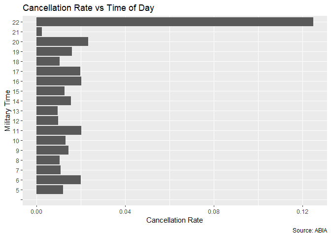
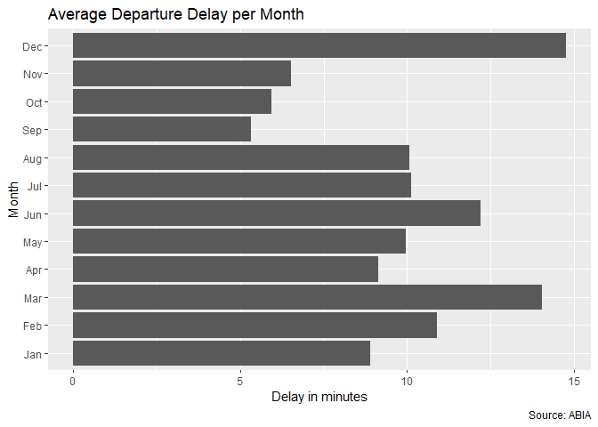
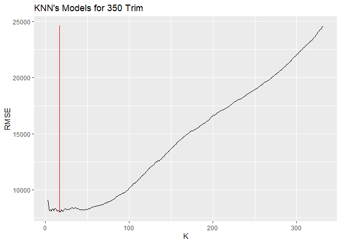
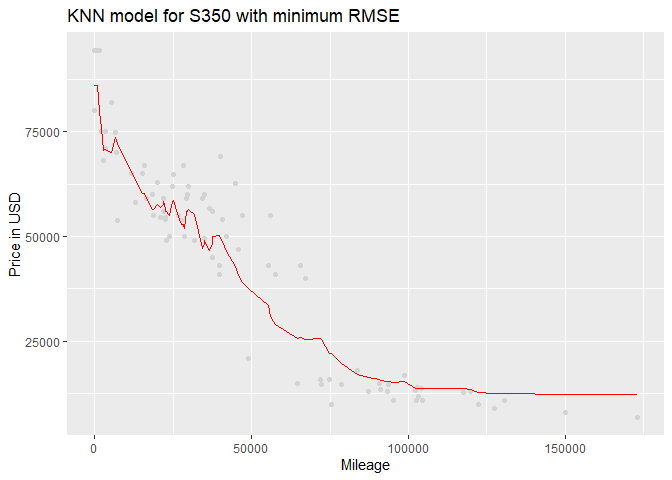
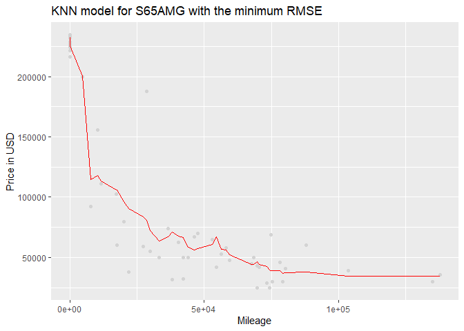

Question 1
==========

Patterns of Delay & Cancellation at Austin Bergstorm Airport
------------------------------------------------------------

We look at the data collected on flights at ABIA to check for intresting
patterns. Some of those patterns include the delay or cancellation of
flights with respect to different carriers, days of the month and days
of the week.

The data includes flights into and out of ABIA. In this exercise we
focus on the patterns of departure delay for flights going out of ABIA.
For this we create a new subset that includes only those flights which
depart from ABIA. Also we consider any flights that depart minutes
before their scheduled time to be on-time and convert negative values to
zeros to give more realistic picture and without affecting average
values for departure delay.

Carrier Wise Patterns of Delays
-------------------------------

The first pattern we try to explore is the average departure delay for
different carriers and see which carriers have more delays on average.
This will show the performance of carriers.

Average Cancellation Rate per Carrier
-------------------------------------

Calculating the average cancellation rate per carriers we see that MQ
has the highest cancellation rate among all carriers that are departing
from ABIA.

Average Departure Delay for Time of the Day
-------------------------------------------

When looking at the average departure delay for different hours of a
day, we see that the peak hours of evening like 17:00 has highest
average departure delay for flights flying out of ABIA. The highest bar
of 00:00 is an outlier and should be ignored because we have only two
flights flying out at 00 hour and only one of them is delayed for 56
mins leading to a higher average delay for that hour.

Average Cancellation for Time of the Day
----------------------------------------

Looking at cancellation pattern for every hour of the day, we see that
the highest cancellation rate occurs for 22:00 hour of the day. Any
flight within this hour has a higher rate of cancellation than flights
flying out at other hours of the day

Average Delay per Month of the Year
-----------------------------------

The average delay of flights flying out of ABIA for each month shows
that the month of December witnesses highest average delays. This can be
attributed to the weather in this month and also the higher number of
flights in holiday season.

Average Cancellation Rate for Month of the Year
-----------------------------------------------

The same analysis of cancellation rate for each month of the year shows
that the month of March saw highest rate of flight cancellation flying
out of ABIA. This can be attributed to weather and higher number of
flights in this month.

Average Delay per Destination of Flight
---------------------------------------

The graph for average delay per destination shows which destination
airports have higher delays for flights flying out of Austin. Des Moines
International Airport has the highest average delay with Newark Liberty
Airport coming second in average delays.

Question 2. K-nearest neighbors
===============================

With information of over 29,000 Mercedes-Benz S Class vehicles, our goal
is to use K-nearest neighbors to build a predictive model for price,
given mileage, separately for each of two trim levels: 350 and 65 AMG.

Model for MB S350
-----------------

### Figure 2.1.

In the figure 2.1. we can see the negative relation between the mileage
and the price, as expected.

The following steep is divide our data between the test and train data
for both variables. After that, we generate random samples of our
subsets of data. Then, we calculate the rsme generated at each level of
K in our k nearest neighbor model for price of a 350 s class given the
mileage.

### Figure 2.2.

The figure 2.2. shows the series of RMSE at every value of K, the red
line indicate the k which generate the minimum RMSE. In this case the k
value is 16. However this value will change any time we generate a new
random sample, to decide the best k we repeated the process ten times
and then we took the average of the minium k.

### Figure 2.3.

    ## [1] 9986.78

After run the model with the best k, we generate the fitted values to
compare with our test subset. the figure 2.3. shows the fit of the
chosen model.

Model for MB S65AMG
-------------------

Now we have to do the same process to find out what is the best model
for the S65 AMG class.

### Figure 2.4.

### Figure 2.5.

The figure 2.5. shows the series of RMSE at every value of K, the red
line indicate the k which generate the minimum RMSE. In this case the k
value which minimize the RMSE for S65 AMG trim is 23. However this value
will change any time we generate a new random sample, to decide the best
k we repeated the process ten times and then we took the average of the
minium k.

### Figure 2.6.

After run the model with the best k, we generate the fitted values to
compare with our test subset. the figure 2.6. shows the fit of the
chosen model.
