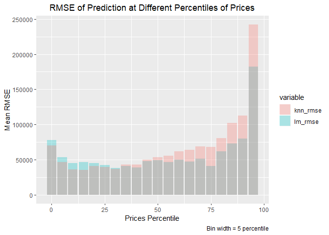

Homework. 2
===========

#### Group Members: Clark, Zach, Zargham

### Question.1 : Saratoga Houses

The question provides a data set of variables associated with house
prices in Saratoga. We have data for more than 1,700 houses which
include their prices, landvalue and other attributes like number of
bedrooms, bathrooms, living area, lotsize etc. The task is to develop
models for predicting the market prices of houses for tax authorities so
that they can tax them at their market value. We use the given sample to
construct two different models for this question.

#### Handbuild Linear Regression Model

The first part of the question asks us to handbuild a linear regression
model with price as dependent variable and using all other variables as
independent variables. We start by assessing the medium model provided
in Professor’s script and check its RMSE by running it on 1000 different
train/test samples.

``` r
Professors Medium model
lm_medium = lm(price ~ lotSize + age + livingArea + pctCollege + bedrooms + 
                   fireplaces + bathrooms + rooms + heating + fuel + centralAir
```

    ## [1] "RMSE for Medium"

    ## [1] 66554.15

#### Part A

We make new variables like extrarooms = rooms - bedrooms. Also we
include two variables landvalue and newConstruction which improves our
RMSE. However, trying composite variables like livingarea per lotsize,
bathrooms per bedroom and using building value by subtracting landvalue
from the property price, did not improve the out of sample RMSE of the
model.

#### Part B

We used Step() function to narrow down variables and interactions that
can give us low variance but the lowest AIC model did not perform better
at out of sample RMSE in multiple iterations. Including more interaction
variables and polynomials manually and one by one also did not help.

Looking at the co-efficients, we can say that lotsize, no. of bedrooms,
no. of bathrooms, living area, central air, heating, fuel and land value
are the most important variables in explaining the prices of houses in
the sample. Some interaction variables also come out to be significant
in the regression model but they do not contribute much to out of sample
RMSE and in most cases increase error in out of sample prediction.

So we decided to have the following model as our final best linear
regression model for house prices.

``` r
Best Linear Regression Fit 
lm(price ~ landValue+lotSize+ livingArea+ bedrooms+ bathrooms+ extrarooms + centralAir + heating + age+ newConstruction+ fireplaces + fuel + age + pctCollege)
```

    ## [1] "RMSE for Best Linear Model"

    ## [1] 59539.19

#### Part C KNN Model

In the third part, the question asks us to fit a K-nearest neighbor
model. We select the same variables as our linear model and scale them
accordingly to fit a KNN model. We did 300 loops for each K starting
from 1 to 300 K’s. The average RMSE declines in the range of 100 to 150
K. However, exact value of K with minimum average RMSE changes with each
iteration of 500 training/ test splits for each K.We selected K = 135
based on our 500 training/ tests sample splits. It gave an RMSE of
80616.


    ## [1] 80616.88

Report: Pricing Model Comparison
--------------------------------

We have two models for predicting the prices of houses in Saratoga. One
is the linear regression model and the other one in KNN model. Both
these models have their strengths and weaknesses. The main metric for
comparing these two models is to check their out of sample prediction
error or RMSE. By running the model on more than 500 different train/
test samples we find out that Linear regression model has lower RMSE
which means that on average linear model is predicting prices accurately
as compared to KNN model.

Linear Regression model Mean RMSE = 59,536.05 KNN Model Mean RMSE at
K-135 = 80,616.88

We run both these models on a same train set and predict values for both
these models on same test to compare their RMSE and Fit for same data
points.

    ## Warning: package 'reshape2' was built under R version 3.6.3

    ## 
    ## Attaching package: 'reshape2'

    ## The following object is masked from 'package:tidyr':
    ## 
    ##     smiths


    ## [1] "LM RMSE"

    ## [1] 68159.41

    ## [1] "KNN RMSE"

    ## [1] 79442.51

Looking at the actual vs predicted plot we see that KNN model’s
predictions are more spread out than LM’s model predictions. We can see
that LM model’s prediction are evenly distributed around the center line
whereas the KNN model’s predictions tend to be on the lower side of the
line thus indicating on average lower prediction of prices as compared
to the actual one.Here we see that LM model has better predictions with
lower RMSE.

We can also see that the predictions for higher prices are far from the
actual prices for both models. This means that both models are not
performing good at extreme values. We check the performance of both
models on prices in lower and higher percentiles and check how their
RMSE perform at the fringe.

We run 100 train/ test random splits of the sample and run both models
for every train/test case and then check for RMSE of both models at
different percentile of prices. The table below shows that the KNN model
has higher error for higher percentile data. That means houses with
higher prices are predicted more inaccurately as compared to houses with
average prices. The RMSE of LM model is also high but lower than KNN
model but for lower percentiles, LM model has slightly higher RMSE than
KNN, however the difference is not as stark as for higher percentile
values. Here we can also prefer LM model over KNN as it also performs
better at extreme values.

Furthermore, root mean square errors for houses that have average prices
are almost the same for both models. This means that both models have
almost similar performance for values around the average.



### Conclusion

We can see that Linear regression model performs better for predicting
prices of houses in Saratoga. The linear model is easily interpretable
and we can see which variables affect prices more. KNN model is a non
parametric model so it is a slow learning model where it has to train on
the data everytime we want to make a new prediction. Furthermore, we
cannot easily see which variables are contributing more towards price
changes.

Given the results, we can clearly say that Linear Regression model is a
better model than KNN in this case. It has low error on average and also
at extreme values.
