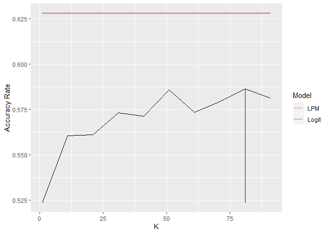

Homework. 2
===========

#### Group Members: Clark Granger, Zachary Carlson and Zargham Khan

### Question.1 : Saratoga Houses

The question provides a data set of variables associated with house
prices in Saratoga. We have data for more than 1,700 houses which
includes their prices, landvalue and other attributes like number of
bedrooms, bathrooms, living area, lotsize etc. The task is to develop
models for predicting the market prices of houses for tax authorities so
that they can tax them at their market value. We use the given sample to
construct two different models for this question.

#### Handbuild Linear Regression Model

The first part of the question asks us to handbuild a linear regression
model with price as dependent variable and using all other variables as
independent variables. We start by assessing the medium model provided
in Professor’s script and check its RMSE by running it on 1000 different
train/test samples.

    Professors Medium model
    lm_medium = lm(price ~ lotSize + age + livingArea + pctCollege + bedrooms + 
                       fireplaces + bathrooms + rooms + heating + fuel + centralAir

    ## [1] "RMSE for Medium"

    ## [1] 66790.95

#### Part A

We make new variables like extrarooms = rooms - bedrooms. Also we
include two variables landvalue and newConstruction which improves our
RMSE. However, trying composite variables like living area per lotsize,
bathrooms per bedroom and building value(subtracting landvalue from the
property price) did not improve the out of sample RMSE of the model. We
observed that adding more variables led to higher variance.

#### Part B

We used Step() function to narrow down variables and interactions that
can give us low variance but the lowest AIC model did not perform better
at out of sample RMSE in multiple iterations. Including more interaction
variables and polynomials manually and one by one also did not help.

Looking at the co-efficients, we can say that lotsize, number of
bedrooms, number of bathrooms, living area, central air, heating, fuel
and land value are the most important variables in explaining the prices
of houses in the sample. Some interaction variables also come out to be
significant in the regression model but they do not contribute much to
out of sample RMSE and in most cases increase error in out of sample
prediction.

So we decided to have the following model as our final best linear
regression model for house prices.

<table>
<colgroup>
<col style="width: 38%" />
<col style="width: 14%" />
<col style="width: 17%" />
<col style="width: 14%" />
<col style="width: 15%" />
</colgroup>
<thead>
<tr class="header">
<th style="text-align: center;"> </th>
<th style="text-align: center;">Estimate</th>
<th style="text-align: center;">Std. Error</th>
<th style="text-align: center;">t value</th>
<th style="text-align: center;">Pr(&gt;|t|)</th>
</tr>
</thead>
<tbody>
<tr class="odd">
<td style="text-align: center;"><strong>(Intercept)</strong></td>
<td style="text-align: center;">22376</td>
<td style="text-align: center;">9849</td>
<td style="text-align: center;">2.272</td>
<td style="text-align: center;">0.02321</td>
</tr>
<tr class="even">
<td style="text-align: center;"><strong>landValue</strong></td>
<td style="text-align: center;">0.9805</td>
<td style="text-align: center;">0.04746</td>
<td style="text-align: center;">20.66</td>
<td style="text-align: center;">7.455e-85</td>
</tr>
<tr class="odd">
<td style="text-align: center;"><strong>lotSize</strong></td>
<td style="text-align: center;">7189</td>
<td style="text-align: center;">2167</td>
<td style="text-align: center;">3.317</td>
<td style="text-align: center;">0.0009279</td>
</tr>
<tr class="even">
<td style="text-align: center;"><strong>livingArea</strong></td>
<td style="text-align: center;">70.7</td>
<td style="text-align: center;">4.687</td>
<td style="text-align: center;">15.08</td>
<td style="text-align: center;">2.345e-48</td>
</tr>
<tr class="odd">
<td style="text-align: center;"><strong>bedrooms</strong></td>
<td style="text-align: center;">-6110</td>
<td style="text-align: center;">2426</td>
<td style="text-align: center;">-2.518</td>
<td style="text-align: center;">0.01189</td>
</tr>
<tr class="even">
<td style="text-align: center;"><strong>bathrooms</strong></td>
<td style="text-align: center;">23656</td>
<td style="text-align: center;">3416</td>
<td style="text-align: center;">6.924</td>
<td style="text-align: center;">6.169e-12</td>
</tr>
<tr class="odd">
<td style="text-align: center;"><strong>extrarooms</strong></td>
<td style="text-align: center;">2848</td>
<td style="text-align: center;">977.5</td>
<td style="text-align: center;">2.914</td>
<td style="text-align: center;">0.003614</td>
</tr>
<tr class="even">
<td style="text-align: center;"><strong>centralAirYes</strong></td>
<td style="text-align: center;">9173</td>
<td style="text-align: center;">3527</td>
<td style="text-align: center;">2.601</td>
<td style="text-align: center;">0.009372</td>
</tr>
<tr class="odd">
<td style="text-align: center;"><strong>heatinghot air</strong></td>
<td style="text-align: center;">-1181</td>
<td style="text-align: center;">12519</td>
<td style="text-align: center;">-0.09436</td>
<td style="text-align: center;">0.9248</td>
</tr>
<tr class="even">
<td style="text-align: center;"><strong>heatinghot water/steam</strong></td>
<td style="text-align: center;">-12225</td>
<td style="text-align: center;">13042</td>
<td style="text-align: center;">-0.9373</td>
<td style="text-align: center;">0.3487</td>
</tr>
<tr class="odd">
<td style="text-align: center;"><strong>age</strong></td>
<td style="text-align: center;">-131.4</td>
<td style="text-align: center;">59.21</td>
<td style="text-align: center;">-2.218</td>
<td style="text-align: center;">0.02665</td>
</tr>
<tr class="even">
<td style="text-align: center;"><strong>newConstructionYes</strong></td>
<td style="text-align: center;">-48977</td>
<td style="text-align: center;">7401</td>
<td style="text-align: center;">-6.618</td>
<td style="text-align: center;">4.866e-11</td>
</tr>
<tr class="odd">
<td style="text-align: center;"><strong>fireplaces</strong></td>
<td style="text-align: center;">1219</td>
<td style="text-align: center;">3034</td>
<td style="text-align: center;">0.4017</td>
<td style="text-align: center;">0.6879</td>
</tr>
<tr class="even">
<td style="text-align: center;"><strong>fuelgas</strong></td>
<td style="text-align: center;">11622</td>
<td style="text-align: center;">12329</td>
<td style="text-align: center;">0.9426</td>
<td style="text-align: center;">0.346</td>
</tr>
<tr class="odd">
<td style="text-align: center;"><strong>fueloil</strong></td>
<td style="text-align: center;">11667</td>
<td style="text-align: center;">12952</td>
<td style="text-align: center;">0.9008</td>
<td style="text-align: center;">0.3678</td>
</tr>
<tr class="even">
<td style="text-align: center;"><strong>pctCollege</strong></td>
<td style="text-align: center;">-242.2</td>
<td style="text-align: center;">151.2</td>
<td style="text-align: center;">-1.602</td>
<td style="text-align: center;">0.1094</td>
</tr>
</tbody>
</table>

<table style="width:88%;">
<caption>Fitting linear model: price ~ landValue + lotSize + livingArea + bedrooms + bathrooms + extrarooms + centralAir + heating + age + newConstruction + fireplaces + fuel + age + pctCollege</caption>
<colgroup>
<col style="width: 20%" />
<col style="width: 30%" />
<col style="width: 12%" />
<col style="width: 23%" />
</colgroup>
<thead>
<tr class="header">
<th style="text-align: center;">Observations</th>
<th style="text-align: center;">Residual Std. Error</th>
<th style="text-align: center;"><em>R</em>2</th>
<th style="text-align: center;">Adjusted <em>R</em>2</th>
</tr>
</thead>
<tbody>
<tr class="odd">
<td style="text-align: center;">1728</td>
<td style="text-align: center;">59222</td>
<td style="text-align: center;">0.6412</td>
<td style="text-align: center;">0.6381</td>
</tr>
</tbody>
</table>

We applied this model on 1000 random train/ test splits of our data and
calculated its out of sample root mean squared error.

    ## [1] "Mean RMSE for Best Linear Model"

    ## [1] 59503.94

#### Part C KNN Model

In the third part, the question asks us to fit a K-nearest neighbor
model. We select the same variables as our linear model and scale them
accordingly to fit a KNN model. We did 300 loops for each K starting
from 1 to 300 K. The average RMSE declines in the range of 100 to 150 K.
However, exact value of K with minimum average RMSE changes with each
iteration of 500 training/ test splits for each K.We selected K = 135
based on our 500 training/ tests sample splits. It gave an RMSE of
80616.

    ## [1] 80616.88

### Report: Pricing Model Comparison

We have two models for predicting the prices of houses in Saratoga. One
is the linear regression model and the other one in KNN model. Both
these models have their strengths and weaknesses. The main metric for
comparing these two models is to check their out of sample prediction
error or RMSE. By running the model on more than 500 different train/
test samples we find out that Linear regression model has lower RMSE
which means that on average linear model is predicting prices more
accurately than the KNN model.

Linear Regression model Mean RMSE = 59,536.05 KNN Model Mean RMSE at
K-135 = 80,616.88

### Single Random Train/Test Performance

We run both these models on a same train set and predict values for both
these models on same test to compare their RMSE and Fit for same data
points.

    ## [1] "LM RMSE"

    ## [1] 67298.18

    ## [1] "KNN RMSE"

    ## [1] 82549.58

Looking at the actual vs predicted plot we see that KNN model’s
predictions are more spread out than LM’s model predictions. We can see
that LM model’s prediction are evenly distributed around the center line
whereas the KNN model’s predictions tend to be on the lower side of the
line thus indicating on average lower prediction of prices as compared
to the actual one.Here we see that LM model has better predictions with
lower RMSE.

We can also see that the predictions for higher prices are far from the
actual prices for both models. This means that both models are not
performing good at extreme values. We check the performance of both
models on prices in lower and higher percentiles and check how their
RMSE perform at the fringe.

We run 100 train/ test random splits of the sample and run both models
for every train/test case and then check for RMSE of both models at
different percentile of prices. The table below shows that the KNN model
has higher error for higher percentile data. That means houses with
higher prices are predicted more inaccurately as compared to houses with
average prices. The RMSE of LM model is also high but lower than KNN
model but for lower percentiles, LM model has slightly higher RMSE than
KNN, however the difference is not as stark as for higher percentile
values. Here we can also prefer LM model over KNN as it also performs
better at extreme values.

Furthermore, root mean square errors for houses that have average prices
are almost the same for both models. This means that both models have
almost similar performance for values around the average.

### Conclusion

We can see that Linear regression model performs better for predicting
prices of houses in Saratoga. The linear model is easily interpretable
and we can see which variables affect prices more.

KNN model is a non parametric model and is known as a slow learning
model where it has to train on the data everytime to make a prediction
for new values. It cannot learn from the training data and cannot
develop a generalize model and that is why it is more susceptible to
noise in data and we saw that its errors increase for outliers.
Furthermore, we cannot easily see which variables are contributing more
towards price changes. With more dimensions or variables the performance
of the KNN model deteriorates as compared to Linear model where adding
more variables might improve prediction.

Given the results, we can clearly say that Linear Regression model is a
better model than KNN in this case. It has low error on average and also
at extreme values.

------------------------------------------------------------------------

### **Question 2: A Hospital Audit**

#### Part 1: Are some radiologists more clinically conservative than others in recalling patients, holding patient risk factors equal?

Here, we model recall decisions on all risk factors and the radiologist
that made the decision to gauge how conservative the doctors are
relative to each other.

    brca = read.csv("brca.csv")
    model_recall = glm(recall ~ . - cancer, data=brca, family=binomial)
    pander(summary(model_recall))

<table>
<colgroup>
<col style="width: 40%" />
<col style="width: 14%" />
<col style="width: 16%" />
<col style="width: 12%" />
<col style="width: 15%" />
</colgroup>
<thead>
<tr class="header">
<th style="text-align: center;"> </th>
<th style="text-align: center;">Estimate</th>
<th style="text-align: center;">Std. Error</th>
<th style="text-align: center;">z value</th>
<th style="text-align: center;">Pr(&gt;|z|)</th>
</tr>
</thead>
<tbody>
<tr class="odd">
<td style="text-align: center;"><strong>(Intercept)</strong></td>
<td style="text-align: center;">-3.275</td>
<td style="text-align: center;">0.6403</td>
<td style="text-align: center;">-5.115</td>
<td style="text-align: center;">3.134e-07</td>
</tr>
<tr class="even">
<td style="text-align: center;"><strong>radiologistradiologist34</strong></td>
<td style="text-align: center;">-0.5217</td>
<td style="text-align: center;">0.3276</td>
<td style="text-align: center;">-1.592</td>
<td style="text-align: center;">0.1113</td>
</tr>
<tr class="odd">
<td style="text-align: center;"><strong>radiologistradiologist66</strong></td>
<td style="text-align: center;">0.3547</td>
<td style="text-align: center;">0.2789</td>
<td style="text-align: center;">1.271</td>
<td style="text-align: center;">0.2036</td>
</tr>
<tr class="even">
<td style="text-align: center;"><strong>radiologistradiologist89</strong></td>
<td style="text-align: center;">0.4638</td>
<td style="text-align: center;">0.2803</td>
<td style="text-align: center;">1.655</td>
<td style="text-align: center;">0.09797</td>
</tr>
<tr class="odd">
<td style="text-align: center;"><strong>radiologistradiologist95</strong></td>
<td style="text-align: center;">-0.05219</td>
<td style="text-align: center;">0.2938</td>
<td style="text-align: center;">-0.1776</td>
<td style="text-align: center;">0.859</td>
</tr>
<tr class="even">
<td style="text-align: center;"><strong>ageage5059</strong></td>
<td style="text-align: center;">0.1112</td>
<td style="text-align: center;">0.2953</td>
<td style="text-align: center;">0.3765</td>
<td style="text-align: center;">0.7065</td>
</tr>
<tr class="odd">
<td style="text-align: center;"><strong>ageage6069</strong></td>
<td style="text-align: center;">0.1568</td>
<td style="text-align: center;">0.3621</td>
<td style="text-align: center;">0.4331</td>
<td style="text-align: center;">0.6649</td>
</tr>
<tr class="even">
<td style="text-align: center;"><strong>ageage70plus</strong></td>
<td style="text-align: center;">0.1078</td>
<td style="text-align: center;">0.3692</td>
<td style="text-align: center;">0.292</td>
<td style="text-align: center;">0.7703</td>
</tr>
<tr class="odd">
<td style="text-align: center;"><strong>history</strong></td>
<td style="text-align: center;">0.2159</td>
<td style="text-align: center;">0.233</td>
<td style="text-align: center;">0.9265</td>
<td style="text-align: center;">0.3542</td>
</tr>
<tr class="even">
<td style="text-align: center;"><strong>symptoms</strong></td>
<td style="text-align: center;">0.7293</td>
<td style="text-align: center;">0.359</td>
<td style="text-align: center;">2.032</td>
<td style="text-align: center;">0.04219</td>
</tr>
<tr class="odd">
<td style="text-align: center;"><strong>menopausepostmenoNoHT</strong></td>
<td style="text-align: center;">-0.1934</td>
<td style="text-align: center;">0.2373</td>
<td style="text-align: center;">-0.815</td>
<td style="text-align: center;">0.4151</td>
</tr>
<tr class="even">
<td style="text-align: center;"><strong>menopausepostmenounknown</strong></td>
<td style="text-align: center;">0.4027</td>
<td style="text-align: center;">0.464</td>
<td style="text-align: center;">0.8678</td>
<td style="text-align: center;">0.3855</td>
</tr>
<tr class="odd">
<td style="text-align: center;"><strong>menopausepremeno</strong></td>
<td style="text-align: center;">0.3421</td>
<td style="text-align: center;">0.3127</td>
<td style="text-align: center;">1.094</td>
<td style="text-align: center;">0.274</td>
</tr>
<tr class="even">
<td style="text-align: center;"><strong>densitydensity2</strong></td>
<td style="text-align: center;">1.22</td>
<td style="text-align: center;">0.539</td>
<td style="text-align: center;">2.264</td>
<td style="text-align: center;">0.02358</td>
</tr>
<tr class="odd">
<td style="text-align: center;"><strong>densitydensity3</strong></td>
<td style="text-align: center;">1.419</td>
<td style="text-align: center;">0.5356</td>
<td style="text-align: center;">2.649</td>
<td style="text-align: center;">0.008063</td>
</tr>
<tr class="even">
<td style="text-align: center;"><strong>densitydensity4</strong></td>
<td style="text-align: center;">1</td>
<td style="text-align: center;">0.602</td>
<td style="text-align: center;">1.662</td>
<td style="text-align: center;">0.09656</td>
</tr>
</tbody>
</table>

(Dispersion parameter for binomial family taken to be 1 )

<table style="width:68%;">
<colgroup>
<col style="width: 29%" />
<col style="width: 38%" />
</colgroup>
<tbody>
<tr class="odd">
<td style="text-align: center;">Null deviance:</td>
<td style="text-align: center;">834.3 on 986 degrees of freedom</td>
</tr>
<tr class="even">
<td style="text-align: center;">Residual deviance:</td>
<td style="text-align: center;">800.0 on 971 degrees of freedom</td>
</tr>
</tbody>
</table>

In this output, we can see the estimates on the different radiologists,
which tells us how conservative they are. Notice, our output only has
four radiologists shown but there are actually 5 radiologists of
interest. The fifth one(radiologist 13) is excluded and represented
within the intercept. Then, the radiologist estimates in this output are
just used to compare against that fifth radiologist. For example,
radiologist 34 has an estimate of -.52, which corresponds to multiplying
the radioligist 13 odds of recall by .6, holding all other risk factors
equal, therefore this radiologist is less conservative than the baseline
radiologist(the fifth radiolist not shown in the output) at the
hospital.

Analagously, radiologist 89 seems to be the most conservative with an
estimate of .46 which cooresponds to multiplying the odds of recall by
1.58(again, comparing to the fifth radiologist not shown in the output),
holding other risk factors constant.

In conclusion, yes, some radioligists seem to be more conservative than
others. This model would suggest that if the same patient saw both
radiologist 34 and radiologist 89, radiologist 89 would be about 2.6
times more likely to recall them. This is a pretty concerning figure. We
would like our cross-doctor reliability to be higher. It seems logical
that there should be some stable risk of cancer that should determine
recall and which doctor you have shouldn’t influence the decision, at
least not to the magnitude we see here. Moreover, here is our
radiologist conservativeness ranking

1.  Radiologist 89

2.  Radiologist 66

3.  Radiologist 13

4.  Radiologist 95

5.  Radiologist 34

#### Part 2: When the radiologists at this hospital interpret a mammogram to make a decision on whether to recall the patient, does the data suggest that they should be weighing some clinical risk factors more heavily than they currently are?

Let’s model cancer versus recall and risk factors. “Model B”(regresses
cancer on recall decision and risk factors) shouldn’t be any better than
“Model A”(regresses cancer on only recall decision) if doctors are using
all the risk factor information to the fullest of its potential.

    model_cancer = glm(cancer ~ ., data=brca, family=binomial)
    pander(summary(model_cancer))

<table>
<colgroup>
<col style="width: 39%" />
<col style="width: 15%" />
<col style="width: 16%" />
<col style="width: 13%" />
<col style="width: 15%" />
</colgroup>
<thead>
<tr class="header">
<th style="text-align: center;"> </th>
<th style="text-align: center;">Estimate</th>
<th style="text-align: center;">Std. Error</th>
<th style="text-align: center;">z value</th>
<th style="text-align: center;">Pr(&gt;|z|)</th>
</tr>
</thead>
<tbody>
<tr class="odd">
<td style="text-align: center;"><strong>(Intercept)</strong></td>
<td style="text-align: center;">-5.475</td>
<td style="text-align: center;">1.309</td>
<td style="text-align: center;">-4.184</td>
<td style="text-align: center;">2.863e-05</td>
</tr>
<tr class="even">
<td style="text-align: center;"><strong>radiologistradiologist34</strong></td>
<td style="text-align: center;">0.01905</td>
<td style="text-align: center;">0.564</td>
<td style="text-align: center;">0.03378</td>
<td style="text-align: center;">0.9731</td>
</tr>
<tr class="odd">
<td style="text-align: center;"><strong>radiologistradiologist66</strong></td>
<td style="text-align: center;">-0.3695</td>
<td style="text-align: center;">0.5412</td>
<td style="text-align: center;">-0.6828</td>
<td style="text-align: center;">0.4948</td>
</tr>
<tr class="even">
<td style="text-align: center;"><strong>radiologistradiologist89</strong></td>
<td style="text-align: center;">-0.2331</td>
<td style="text-align: center;">0.5699</td>
<td style="text-align: center;">-0.4091</td>
<td style="text-align: center;">0.6824</td>
</tr>
<tr class="odd">
<td style="text-align: center;"><strong>radiologistradiologist95</strong></td>
<td style="text-align: center;">-0.3848</td>
<td style="text-align: center;">0.5781</td>
<td style="text-align: center;">-0.6657</td>
<td style="text-align: center;">0.5056</td>
</tr>
<tr class="even">
<td style="text-align: center;"><strong>recall</strong></td>
<td style="text-align: center;">2.336</td>
<td style="text-align: center;">0.3686</td>
<td style="text-align: center;">6.336</td>
<td style="text-align: center;">2.353e-10</td>
</tr>
<tr class="odd">
<td style="text-align: center;"><strong>ageage5059</strong></td>
<td style="text-align: center;">0.4779</td>
<td style="text-align: center;">0.6393</td>
<td style="text-align: center;">0.7475</td>
<td style="text-align: center;">0.4547</td>
</tr>
<tr class="even">
<td style="text-align: center;"><strong>ageage6069</strong></td>
<td style="text-align: center;">0.3983</td>
<td style="text-align: center;">0.8128</td>
<td style="text-align: center;">0.4901</td>
<td style="text-align: center;">0.6241</td>
</tr>
<tr class="odd">
<td style="text-align: center;"><strong>ageage70plus</strong></td>
<td style="text-align: center;">1.436</td>
<td style="text-align: center;">0.7367</td>
<td style="text-align: center;">1.95</td>
<td style="text-align: center;">0.05119</td>
</tr>
<tr class="even">
<td style="text-align: center;"><strong>history</strong></td>
<td style="text-align: center;">0.2475</td>
<td style="text-align: center;">0.4388</td>
<td style="text-align: center;">0.564</td>
<td style="text-align: center;">0.5727</td>
</tr>
<tr class="odd">
<td style="text-align: center;"><strong>symptoms</strong></td>
<td style="text-align: center;">-0.008199</td>
<td style="text-align: center;">0.7158</td>
<td style="text-align: center;">-0.01145</td>
<td style="text-align: center;">0.9909</td>
</tr>
<tr class="even">
<td style="text-align: center;"><strong>menopausepostmenoNoHT</strong></td>
<td style="text-align: center;">-0.1731</td>
<td style="text-align: center;">0.4556</td>
<td style="text-align: center;">-0.38</td>
<td style="text-align: center;">0.704</td>
</tr>
<tr class="odd">
<td style="text-align: center;"><strong>menopausepostmenounknown</strong></td>
<td style="text-align: center;">0.82</td>
<td style="text-align: center;">0.7283</td>
<td style="text-align: center;">1.126</td>
<td style="text-align: center;">0.2602</td>
</tr>
<tr class="even">
<td style="text-align: center;"><strong>menopausepremeno</strong></td>
<td style="text-align: center;">0.2305</td>
<td style="text-align: center;">0.6618</td>
<td style="text-align: center;">0.3482</td>
<td style="text-align: center;">0.7277</td>
</tr>
<tr class="odd">
<td style="text-align: center;"><strong>densitydensity2</strong></td>
<td style="text-align: center;">0.718</td>
<td style="text-align: center;">1.08</td>
<td style="text-align: center;">0.6651</td>
<td style="text-align: center;">0.506</td>
</tr>
<tr class="even">
<td style="text-align: center;"><strong>densitydensity3</strong></td>
<td style="text-align: center;">0.835</td>
<td style="text-align: center;">1.081</td>
<td style="text-align: center;">0.772</td>
<td style="text-align: center;">0.4401</td>
</tr>
<tr class="odd">
<td style="text-align: center;"><strong>densitydensity4</strong></td>
<td style="text-align: center;">1.998</td>
<td style="text-align: center;">1.134</td>
<td style="text-align: center;">1.762</td>
<td style="text-align: center;">0.07803</td>
</tr>
</tbody>
</table>

(Dispersion parameter for binomial family taken to be 1 )

<table style="width:68%;">
<colgroup>
<col style="width: 29%" />
<col style="width: 38%" />
</colgroup>
<tbody>
<tr class="odd">
<td style="text-align: center;">Null deviance:</td>
<td style="text-align: center;">315.6 on 986 degrees of freedom</td>
</tr>
<tr class="even">
<td style="text-align: center;">Residual deviance:</td>
<td style="text-align: center;">260.3 on 970 degrees of freedom</td>
</tr>
</tbody>
</table>

This result implies that Model B is better than Model A from above
because the model is giving esimates to some of the risk factors even
after controling for recall. If doctors were correctly weighting all
risk factors in their recall decisions, the only non-zero estimate
should be on the recall feature. The recall variable is a proxy for the
probability of cancer since doctors want the most-at-risk patients to be
further evaluated. So, the fact that there are non-zero estimates on
features that aren’t recall suggests the model was improved even after
using the recall decisions by incorporating risk factors that shoud have
already been used in recall.

There are some pretty large estimates on some of the risk factors! For
example, tissue density type 4 had an estimate of 1.998 which
cooresponds to being 7.37x more likely to have cancer than patients with
density 1, holding all else fixed.

Family history of cancer, tissue density, and age all seem to have some
extra information that could be utilized in the recall decision.
Patients with tissue density 4 are 7.4x more likely to get cancer,
holding recall decision fixed. Patients with family history of cancer
are 1.28x more likely to get cancer than patients without history of
breast cancer, holding recall decision fixed. This “incorrect” weighting
of risk factors also shows up in the raw error rates below. This can be
seen below in the increase in false positives and false negatives when
moving from history=0 to history=1. 1.5% of the patients who weren’t
recalled ended up having cancer when they didn’t have any family history
of breast cancer. When they did have family history of breast cancer,
this figure jumps to 2.75%. 84.8% of the patients who were recalled
didn’t end up having cancer in the case where they had no family history
of breast cancer. In the case where they did have family history of
breast cancer, this figure jumps to 86.2%. This reinforces the fact that
we could get better recall performance from weighting tissue density 4
and family history of breast cancer more heavily in our decision to
perform addition diagnostic tests or not. There are other factors with
similar results but I just went over two of them.

    pander((xtabs(~cancer + recall + history, brca) %>% prop.table(margin=c(2, 3))))

<table style="width:67%;">
<colgroup>
<col style="width: 12%" />
<col style="width: 12%" />
<col style="width: 13%" />
<col style="width: 13%" />
<col style="width: 13%" />
</colgroup>
<tbody>
<tr class="odd">
<td></td>
<td></td>
<td style="text-align: center;">history</td>
<td style="text-align: center;">0</td>
<td style="text-align: center;">1</td>
</tr>
<tr class="even">
<td>cancer</td>
<td>recall</td>
<td style="text-align: center;"></td>
<td style="text-align: center;"></td>
<td style="text-align: center;"></td>
</tr>
<tr class="odd">
<td>0</td>
<td>0</td>
<td style="text-align: center;"></td>
<td style="text-align: center;">0.9841</td>
<td style="text-align: center;">0.9724</td>
</tr>
<tr class="even">
<td></td>
<td>1</td>
<td style="text-align: center;"></td>
<td style="text-align: center;">0.8487</td>
<td style="text-align: center;">0.8621</td>
</tr>
<tr class="odd">
<td>1</td>
<td>0</td>
<td style="text-align: center;"></td>
<td style="text-align: center;">0.01585</td>
<td style="text-align: center;">0.02759</td>
</tr>
<tr class="even">
<td></td>
<td>1</td>
<td style="text-align: center;"></td>
<td style="text-align: center;">0.1513</td>
<td style="text-align: center;">0.1379</td>
</tr>
</tbody>
</table>

    pander(xtabs(~cancer + recall + density, brca) %>% prop.table(margin=c(2, 3)))

<table>
<colgroup>
<col style="width: 12%" />
<col style="width: 12%" />
<col style="width: 13%" />
<col style="width: 15%" />
<col style="width: 15%" />
<col style="width: 15%" />
<col style="width: 15%" />
</colgroup>
<tbody>
<tr class="odd">
<td></td>
<td></td>
<td style="text-align: center;">density</td>
<td style="text-align: center;">density1</td>
<td style="text-align: center;">density2</td>
<td style="text-align: center;">density3</td>
<td style="text-align: center;">density4</td>
</tr>
<tr class="even">
<td>cancer</td>
<td>recall</td>
<td style="text-align: center;"></td>
<td style="text-align: center;"></td>
<td style="text-align: center;"></td>
<td style="text-align: center;"></td>
<td style="text-align: center;"></td>
</tr>
<tr class="odd">
<td>0</td>
<td>0</td>
<td style="text-align: center;"></td>
<td style="text-align: center;">1</td>
<td style="text-align: center;">0.9859</td>
<td style="text-align: center;">0.9815</td>
<td style="text-align: center;">0.956</td>
</tr>
<tr class="even">
<td></td>
<td>1</td>
<td style="text-align: center;"></td>
<td style="text-align: center;">0.75</td>
<td style="text-align: center;">0.8542</td>
<td style="text-align: center;">0.8765</td>
<td style="text-align: center;">0.7333</td>
</tr>
<tr class="odd">
<td>1</td>
<td>0</td>
<td style="text-align: center;"></td>
<td style="text-align: center;">0</td>
<td style="text-align: center;">0.01408</td>
<td style="text-align: center;">0.01847</td>
<td style="text-align: center;">0.04396</td>
</tr>
<tr class="even">
<td></td>
<td>1</td>
<td style="text-align: center;"></td>
<td style="text-align: center;">0.25</td>
<td style="text-align: center;">0.1458</td>
<td style="text-align: center;">0.1235</td>
<td style="text-align: center;">0.2667</td>
</tr>
</tbody>
</table>

In conclusion, the doctors could adjust how they are currently weighting
different risk factors to make more accurate evidence-based decisions
about recall and reduce unneccessary diagnostic tests as well as make
sure people who need diagnostic tests are getting them. Ultimately, this
should also lead to better outcomes for the patients because we will
catch the cancer sooner for the patients who have breast cancer.

------------------------------------------------------------------------

Question 3: Predicting when articles go viral
---------------------------------------------

Using the data of 39,797 online articles published by Mashable during
2013 and 2014, the goal is building a model to determine if an article
goes viral or not. An article is considered viral if it was shared more
than 1400 times. We have a set o features of each article such as things
like how long the headline is, how long the article is, how positive or
negative the “sentiment” of the article was, among others. Beyond to get
the best model to classify, Mashable wants to know if there is anything
they can learn about how to improve an article’s chance of reaching this
threshold.

To deal with this problem we are going to work with two approach. The
first approach is from the standpoint of regression. we will build three
models following techniques such as linear regression, K nearest
neighbor and transforming the objective variable. In this first approach
the objective variable will be the number of shares. The second approach
is from the standpoint of classification. In this case our objective
variable will be a binary entry Viral, which is 1 if the article is
viral or 0 otherwise. In both approach, we have measures that help us to
classify the model performance.

### Approach \#1 Working with Shares as objective variable

In the first approach our objective variable is number of shares. To
start we anylized all the set of features([see
features](https://github.com/jgscott/ECO395M/blob/master/data/online_news_codes.txt))
we have to decide which of them are important to include in the models.
Then we start fitting linear models with several combinations of
variables. We used the function step to test if including some
interactions in the model would be helpful, but finally we decided work
with a more parsimonious model, given it has a good fitting. Below we
can see the variables we used in our linear models, we ran the first
using shares as explained variable and then we used log of shares as
explanatory variable. Then, we decided to try with a knn model as well.
For this last model, we did not consider the binary variables since they
do not add too much information in this methodology. The variables used
in the knn model are summarized below.

**Specification for Linear models:**

Shares or log(Shares) ~ n\_tokens\_title + n\_tokens\_content +
num\_hrefs + num\_self\_hrefs + num\_imgs + num\_videos +
average\_token\_length + num\_keywords + data\_channel\_is\_lifestyle +
data\_channel\_is\_entertainment + data\_channel\_is\_bus +
data\_channel\_is\_socmed + data\_channel\_is\_tech +
data\_channel\_is\_world + self\_reference\_avg\_sharess + is\_weekend +
global\_rate\_negative\_words + global\_rate\_positive\_words +
title\_subjectivity

**For KNN model the specification:**

Shares ~ n\_tokens\_title, n\_tokens\_content, num\_hrefs,
num\_self\_hrefs, num\_imgs, num\_videos, average\_token\_length,
num\_keywords, self\_reference\_avg\_sharess

Since the predictions of our model are numerical (number of shares), we
needed the evaluation in terms of a binary prediction (viral or not).
For that reason after generated prediction of our models across multiple
train/test splits we summarized the accuracy rate of each model
considering a threshold of 1400 shares to consider an article viral. In
the table 1 we can see the accuracy ratio for our three models plus a
“null” model that always predicts the articles as “not viral”.

**Table 1. Accuracy rate for models with Shares as objective variable**

<table>
<thead>
<tr class="header">
<th></th>
<th style="text-align: right;">Accuracy Rate</th>
</tr>
</thead>
<tbody>
<tr class="odd">
<td>Null Model</td>
<td style="text-align: right;">0.5065742</td>
</tr>
<tr class="even">
<td>Linear Model</td>
<td style="text-align: right;">0.4946929</td>
</tr>
<tr class="odd">
<td>KNN Model</td>
<td style="text-align: right;">0.5323496</td>
</tr>
<tr class="even">
<td>Linear Model (Log Shares)</td>
<td style="text-align: right;">0.5875760</td>
</tr>
</tbody>
</table>

In table 1 we can observe so far the model with the best accuracy is the
linear model over the log of shares. We can see that the linear model
over shares is even worse that the null model. We can see that the
linear model of log shares has a gain in accuracy of 8.1001811%
comparing with the null model, it means a lift of 1.1599012.

Having found our best model for the prediction of number of shares we
proceed to present the Confusion matrix and the requested stats:

**Table 2. Confusion Matrix for the Linear Model of Log of Shares**

<table>
<thead>
<tr class="header">
<th></th>
<th style="text-align: right;">Linear Model Log (Shares)</th>
</tr>
</thead>
<tbody>
<tr class="odd">
<td>True Negative</td>
<td style="text-align: right;">1315.90</td>
</tr>
<tr class="even">
<td>False Negative</td>
<td style="text-align: right;">571.32</td>
</tr>
<tr class="odd">
<td>False Positive</td>
<td style="text-align: right;">2698.79</td>
</tr>
<tr class="even">
<td>True Positive</td>
<td style="text-align: right;">3342.99</td>
</tr>
</tbody>
</table>

**The stats are the following:**

Overall error rate = 41.2424013%

True positive rate = 85.4043241%

False positive rate = 67.222874%

### Approach \#2 Working with binary variable viral as objective

In the second approach we handled this problem from the standpoint of
classification. That is, we defined a binary variable viral and built
our very models for directly predicting viral status as a target
variable. We worked with the same specification of our first lineal
model, but using Linear probability model regression and a a logit model
regression. In the case of the Knn approach we used the same variables
of the knn model for shares.The table 3 summarized the accuracy rate for
the three classification models.

**Table 3. Accuracy rate for models with viral as objective variable**

<table>
<thead>
<tr class="header">
<th></th>
<th style="text-align: right;">Accuracy Rate</th>
</tr>
</thead>
<tbody>
<tr class="odd">
<td>Linear Probability Model</td>
<td style="text-align: right;">0.6282230</td>
</tr>
<tr class="even">
<td>Logit Model</td>
<td style="text-align: right;">0.6279329</td>
</tr>
<tr class="odd">
<td>KNN Classification Model</td>
<td style="text-align: right;">0.5863287</td>
</tr>
</tbody>
</table>

In the table 3 we can see that the model with the best accuraccy is the
Logit Model, which is slightly superior to the Linear Probability model
(0.6279329 vs 0.628223). This result was expected since in this approach
we are working directly over the binary variable, then the prediction
rank will have less variation. In the first case we predicted the number
of shares, which have a huge rank of possible outcomes. In the table 4,
we present the confusion matrix for our best model and then we present
the requested stats. We can see that the logistic model gives a gain of
accuracy of 4.0356918% over the lineal model of log shares. It
represents a lift of 1.0686837.

**Table 4. Confusion Matrix for the Logistic Model of Viral**

<table>
<thead>
<tr class="header">
<th></th>
<th style="text-align: right;">Logit Model</th>
</tr>
</thead>
<tbody>
<tr class="odd">
<td>True Negative</td>
<td style="text-align: right;">2484.37</td>
</tr>
<tr class="even">
<td>False Negative</td>
<td style="text-align: right;">1417.19</td>
</tr>
<tr class="odd">
<td>False Positive</td>
<td style="text-align: right;">1532.93</td>
</tr>
<tr class="even">
<td>True Positive</td>
<td style="text-align: right;">2494.51</td>
</tr>
</tbody>
</table>

**The stats are the following:**

Overall error rate = 37.2067095%

True positive rate = 63.7704834%

False positive rate = 38.1582157%

In addition, we decided to include a graph to see the advantages in
accuracy of the probabilistic models over the Knn classification model
with differents values of K (see graph 1).

**Graph 1. KNN models vs LPM and Logit Models**

    ## $x
    ## [1] "K"
    ## 
    ## $y
    ## [1] "Accuracy Rate"
    ## 
    ## attr(,"class")
    ## [1] "labels"

\#\#\#How can we increase the probability that an article goes viral?

By this point we have adressed the problem to find the best model to
predict with the highest accuracy the binary output viral. But we also
want to know what features would increase the probability of an article
to go viral or not. However, since our best model is a logistic model we
know that the coefficients generated do not have a direct interpretation
as a causal effect, in this case a probability of succes. Therefore, in
table 6 we compute the average marginal effect of all the variables we
included in our logit model, because them can be readed as the partial
causal effect of each variable over the probability of an article to go
viral. Thus, if we want to increase the probability to be viral we
should increase the features with the higher partial effect such as
writing an article about social media or releasing the article in a
weekend. In the other hand we should avoid the characteristic that have
a negative partial effect such as writing about entertainment or
including a large number of negative words.

**Table 5. Average Marginal Effects of the Logit Model**

<table>
<thead>
<tr class="header">
<th style="text-align: left;">factor</th>
<th style="text-align: right;">AME</th>
<th style="text-align: right;">SE</th>
<th style="text-align: right;">z</th>
<th style="text-align: right;">p</th>
<th style="text-align: right;">lower</th>
<th style="text-align: right;">upper</th>
</tr>
</thead>
<tbody>
<tr class="odd">
<td style="text-align: left;">average_token_length</td>
<td style="text-align: right;">-0.0216477</td>
<td style="text-align: right;">0.0036429</td>
<td style="text-align: right;">-5.942375</td>
<td style="text-align: right;">0.0000000</td>
<td style="text-align: right;">-0.0287878</td>
<td style="text-align: right;">-0.0145077</td>
</tr>
<tr class="even">
<td style="text-align: left;">data_channel_is_bus</td>
<td style="text-align: right;">-0.0626236</td>
<td style="text-align: right;">0.0104780</td>
<td style="text-align: right;">-5.976649</td>
<td style="text-align: right;">0.0000000</td>
<td style="text-align: right;">-0.0831601</td>
<td style="text-align: right;">-0.0420870</td>
</tr>
<tr class="odd">
<td style="text-align: left;">data_channel_is_entertainment</td>
<td style="text-align: right;">-0.1937165</td>
<td style="text-align: right;">0.0095472</td>
<td style="text-align: right;">-20.290290</td>
<td style="text-align: right;">0.0000000</td>
<td style="text-align: right;">-0.2124287</td>
<td style="text-align: right;">-0.1750042</td>
</tr>
<tr class="even">
<td style="text-align: left;">data_channel_is_lifestyle</td>
<td style="text-align: right;">-0.0469791</td>
<td style="text-align: right;">0.0139239</td>
<td style="text-align: right;">-3.373994</td>
<td style="text-align: right;">0.0007409</td>
<td style="text-align: right;">-0.0742694</td>
<td style="text-align: right;">-0.0196888</td>
</tr>
<tr class="odd">
<td style="text-align: left;">data_channel_is_socmed</td>
<td style="text-align: right;">0.1640990</td>
<td style="text-align: right;">0.0142668</td>
<td style="text-align: right;">11.502147</td>
<td style="text-align: right;">0.0000000</td>
<td style="text-align: right;">0.1361366</td>
<td style="text-align: right;">0.1920615</td>
</tr>
<tr class="even">
<td style="text-align: left;">data_channel_is_tech</td>
<td style="text-align: right;">0.0260094</td>
<td style="text-align: right;">0.0101341</td>
<td style="text-align: right;">2.566523</td>
<td style="text-align: right;">0.0102724</td>
<td style="text-align: right;">0.0061469</td>
<td style="text-align: right;">0.0458719</td>
</tr>
<tr class="odd">
<td style="text-align: left;">data_channel_is_world</td>
<td style="text-align: right;">-0.2056578</td>
<td style="text-align: right;">0.0099429</td>
<td style="text-align: right;">-20.683926</td>
<td style="text-align: right;">0.0000000</td>
<td style="text-align: right;">-0.2251455</td>
<td style="text-align: right;">-0.1861701</td>
</tr>
<tr class="even">
<td style="text-align: left;">global_rate_negative_words</td>
<td style="text-align: right;">-0.4732438</td>
<td style="text-align: right;">0.2652483</td>
<td style="text-align: right;">-1.784154</td>
<td style="text-align: right;">0.0743986</td>
<td style="text-align: right;">-0.9931209</td>
<td style="text-align: right;">0.0466332</td>
</tr>
<tr class="odd">
<td style="text-align: left;">global_rate_positive_words</td>
<td style="text-align: right;">0.3953095</td>
<td style="text-align: right;">0.1755274</td>
<td style="text-align: right;">2.252125</td>
<td style="text-align: right;">0.0243144</td>
<td style="text-align: right;">0.0512823</td>
<td style="text-align: right;">0.7393368</td>
</tr>
<tr class="even">
<td style="text-align: left;">is_weekend</td>
<td style="text-align: right;">0.1844226</td>
<td style="text-align: right;">0.0080658</td>
<td style="text-align: right;">22.864637</td>
<td style="text-align: right;">0.0000000</td>
<td style="text-align: right;">0.1686139</td>
<td style="text-align: right;">0.2002314</td>
</tr>
<tr class="odd">
<td style="text-align: left;">n_tokens_content</td>
<td style="text-align: right;">0.0000335</td>
<td style="text-align: right;">0.0000072</td>
<td style="text-align: right;">4.634481</td>
<td style="text-align: right;">0.0000036</td>
<td style="text-align: right;">0.0000193</td>
<td style="text-align: right;">0.0000477</td>
</tr>
<tr class="even">
<td style="text-align: left;">n_tokens_title</td>
<td style="text-align: right;">-0.0025548</td>
<td style="text-align: right;">0.0012990</td>
<td style="text-align: right;">-1.966737</td>
<td style="text-align: right;">0.0492136</td>
<td style="text-align: right;">-0.0051007</td>
<td style="text-align: right;">-0.0000088</td>
</tr>
<tr class="odd">
<td style="text-align: left;">num_hrefs</td>
<td style="text-align: right;">0.0029942</td>
<td style="text-align: right;">0.0003187</td>
<td style="text-align: right;">9.395224</td>
<td style="text-align: right;">0.0000000</td>
<td style="text-align: right;">0.0023696</td>
<td style="text-align: right;">0.0036188</td>
</tr>
<tr class="even">
<td style="text-align: left;">num_imgs</td>
<td style="text-align: right;">0.0019661</td>
<td style="text-align: right;">0.0003886</td>
<td style="text-align: right;">5.059099</td>
<td style="text-align: right;">0.0000004</td>
<td style="text-align: right;">0.0012044</td>
<td style="text-align: right;">0.0027277</td>
</tr>
<tr class="odd">
<td style="text-align: left;">num_keywords</td>
<td style="text-align: right;">0.0113735</td>
<td style="text-align: right;">0.0014687</td>
<td style="text-align: right;">7.744022</td>
<td style="text-align: right;">0.0000000</td>
<td style="text-align: right;">0.0084950</td>
<td style="text-align: right;">0.0142521</td>
</tr>
<tr class="even">
<td style="text-align: left;">num_self_hrefs</td>
<td style="text-align: right;">-0.0063706</td>
<td style="text-align: right;">0.0008278</td>
<td style="text-align: right;">-7.696211</td>
<td style="text-align: right;">0.0000000</td>
<td style="text-align: right;">-0.0079930</td>
<td style="text-align: right;">-0.0047482</td>
</tr>
<tr class="odd">
<td style="text-align: left;">num_videos</td>
<td style="text-align: right;">0.0007800</td>
<td style="text-align: right;">0.0007063</td>
<td style="text-align: right;">1.104285</td>
<td style="text-align: right;">0.2694695</td>
<td style="text-align: right;">-0.0006044</td>
<td style="text-align: right;">0.0021644</td>
</tr>
<tr class="even">
<td style="text-align: left;">self_reference_avg_sharess</td>
<td style="text-align: right;">0.0000016</td>
<td style="text-align: right;">0.0000002</td>
<td style="text-align: right;">8.225942</td>
<td style="text-align: right;">0.0000000</td>
<td style="text-align: right;">0.0000012</td>
<td style="text-align: right;">0.0000020</td>
</tr>
<tr class="odd">
<td style="text-align: left;">title_subjectivity</td>
<td style="text-align: right;">0.0317238</td>
<td style="text-align: right;">0.0084504</td>
<td style="text-align: right;">3.754111</td>
<td style="text-align: right;">0.0001740</td>
<td style="text-align: right;">0.0151613</td>
<td style="text-align: right;">0.0482863</td>
</tr>
</tbody>
</table>
