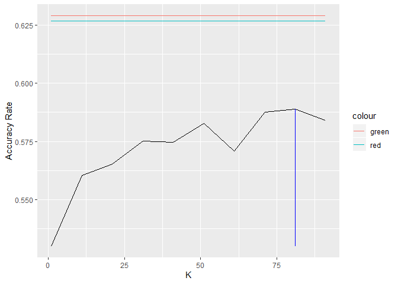

Using the data of 39,797 online articles published by Mashable during
2013 and 2014, the goal is building a model to determine if an article
goes viral or not. An article is considered viral if it was shared more
than 1400 times. We have a set o features of each article such as things
like how long the headline is, how long the article is, how positive or
negative the “sentiment” of the article was, among others. Beyond to get
the best model to classify, Mashable wants to know if there is anything
they can learn about how to improve an article’s chance of reaching this
threshold.

To deal with this problem we are going to work with two approach. The
first approach is from the standpoint of regression. we will build three
models following techniques such as linear regression, K nearest
neighbor and transforming the objective variable. In this first approach
the objective variable will be the number of shares. The second approach
is from the standpoint of classification. In this case our objective
variable will be a binary entry Viral, which is 1 if the article is
viral or 0 otherwise. In both approach, we have measures that help us to
classify the model performance.

Approach \#1 Working with Shares as objective variable
------------------------------------------------------

In the first approach our objective variable is number of shares. To
start we anylized all the set of features([see
features](https://github.com/jgscott/ECO395M/blob/master/data/online_news_codes.txt))
we have to decide which of them are important to include in the models.
Then we start fitting linear models with several combinations of
variables. We used the function step to test if including some
interactions in the model would be helpful, but finally we decided work
with a more parsimonious model, given it has a good fitting. Below we
can see the variables we used in our linear models, we ran the first
using shares as explained variable and then we used log of shares as
explanatory variable. Then, we decided to try with a knn model as well.
For this last model, we did not consider the binary variables since they
do not add too much information in this methodology. The variables used
in the knn model are summarized below.

**Specification for Linear models:**

Shares or log(Shares) ~ n\_tokens\_title + n\_tokens\_content +
num\_hrefs + num\_self\_hrefs + num\_imgs + num\_videos +
average\_token\_length + num\_keywords + data\_channel\_is\_lifestyle +
data\_channel\_is\_entertainment + data\_channel\_is\_bus +
data\_channel\_is\_socmed + data\_channel\_is\_tech +
data\_channel\_is\_world + self\_reference\_avg\_sharess + is\_weekend +
global\_rate\_negative\_words + global\_rate\_positive\_words +
title\_subjectivity

**For KNN model the specification:**

Shares ~ n\_tokens\_title, n\_tokens\_content, num\_hrefs,
num\_self\_hrefs, num\_imgs, num\_videos, average\_token\_length,
num\_keywords, self\_reference\_avg\_sharess

Since the predictions of our model are numerical (number of shares), we
needed the evaluation in terms of a binary prediction (viral or not).
For that reason after generated prediction of our models across multiple
train/test splits we summarized the accuracy rate of each model
considering a threshold of 1400 shares to consider an article viral. In
the table 1 we can see the accuracy ratio for our three models plus a
“null” model that always predicts the articles as “not viral”.

**Table 1. Accuracy rate for models with Shares as objective variable**

<table>
<thead>
<tr class="header">
<th></th>
<th style="text-align: right;">Accuracy Rate</th>
</tr>
</thead>
<tbody>
<tr class="odd">
<td>Null Model</td>
<td style="text-align: right;">0.5055021</td>
</tr>
<tr class="even">
<td>Linear Model</td>
<td style="text-align: right;">0.4953462</td>
</tr>
<tr class="odd">
<td>KNN Model</td>
<td style="text-align: right;">0.5275571</td>
</tr>
<tr class="even">
<td>Linear Model (Log Shares)</td>
<td style="text-align: right;">0.5880376</td>
</tr>
</tbody>
</table>

In table 1 we can observe so far the model with the best accuracy is the
linear model over the log of shares. We can see that the linear model
over shares is even worse that the null model. We can see that the
linear model of log shares has a gain in accuracy of 8.2535455%
comparing with the null model, it means a lift of 1.1632742.

Having found our best model for the prediction of number of shares we
proceed to present the Confusion matrix and the requested stats:

**Table 2. Confusion Matrix for the Linear Model of Log of Shares**

<table>
<thead>
<tr class="header">
<th></th>
<th style="text-align: right;">Linear Model Log (Shares)</th>
</tr>
</thead>
<tbody>
<tr class="odd">
<td>True Negative</td>
<td style="text-align: right;">1318.97</td>
</tr>
<tr class="even">
<td>False Negative</td>
<td style="text-align: right;">572.91</td>
</tr>
<tr class="odd">
<td>False Positive</td>
<td style="text-align: right;">2693.54</td>
</tr>
<tr class="even">
<td>True Positive</td>
<td style="text-align: right;">3343.58</td>
</tr>
</tbody>
</table>

**The stats are the following:**

Overall error rate = 41.1962416%

True positive rate = 85.3718508%

False positive rate = 67.1285554%

Approach \#2 Working with binary variable viral as objective
------------------------------------------------------------

In the second approach we handled this problem from the standpoint of
classification. That is, we defined a binary variable viral and built
our very models for directly predicting viral status as a target
variable. We worked with the same specification of our first lineal
model, but using Linear probability model regression and a a logit model
regression. In the case of the Knn approach we used the same variables
of the knn model for shares.The table 3 summarized the accuracy rate for
the three classification models.

**Table 3. Accuracy rate for models with viral as objective variable**

<table>
<thead>
<tr class="header">
<th></th>
<th style="text-align: right;">Accuracy Rate</th>
</tr>
</thead>
<tbody>
<tr class="odd">
<td>Linear Probability Model</td>
<td style="text-align: right;">0.6278749</td>
</tr>
<tr class="even">
<td>Logit Model</td>
<td style="text-align: right;">0.6272405</td>
</tr>
<tr class="odd">
<td>KNN Classification Model</td>
<td style="text-align: right;">0.5824190</td>
</tr>
</tbody>
</table>

In the table 3 we can see that the model with the best accuraccy is the
Logit Model, which is slightly superior to the Linear Probability model
(0.6272405 vs 0.6278749). This result was expected since in this
approach we are working directly over the binary variable, then the
prediction rank will have less variation. In the first case we predicted
the number of shares, which have a huge rank of possible outcomes. In
the table 4, we present the confusion matrix for our best model and then
we present the requested stats. We can see that the logistic model gives
a gain of accuracy of 3.9202926% over the lineal model of log shares. It
represents a lift of 1.0666674.

**Table 4. Confusion Matrix for the Logistic Model of Viral**

<table>
<thead>
<tr class="header">
<th></th>
<th style="text-align: right;">Logit Model</th>
</tr>
</thead>
<tbody>
<tr class="odd">
<td>True Negative</td>
<td style="text-align: right;">2481.31</td>
</tr>
<tr class="even">
<td>False Negative</td>
<td style="text-align: right;">1417.38</td>
</tr>
<tr class="odd">
<td>False Positive</td>
<td style="text-align: right;">1538.23</td>
</tr>
<tr class="even">
<td>True Positive</td>
<td style="text-align: right;">2492.08</td>
</tr>
</tbody>
</table>

**The stats are the following:**

Overall error rate = 37.275949%

True positive rate = 63.744865%

False positive rate = 38.2688069%

In addition, we decided to include a graph to see the advantages in
accuracy of the probabilistic models over the Knn classification model
with differents values of K (see graph 1).

**Graph 1. KNN models vs LPM and Logit Models**

How can we increase the probability that an article goes viral?
---------------------------------------------------------------

By this point we have adressed the problem to find the best model to
predict with the highest accuracy the binary output viral. But we also
want to know what features would increase the probability of an article
to go viral or not. However, since our best model is a logistic model we
know that the coefficients generated do not have a direct interpretation
as a causal effect, in this case a probability of succes. Therefore, in
table 6 we compute the average marginal effect of all the variables we
included in our logit model, because them can be readed as the partial
causal effect of each variable over the probability of an article to go
viral. Thus, if we want to increase the probability to be viral we
should increase the features with the higher partial effect such as
writing an article about social media or releasing the article in a
weekend. In the other hand we should avoid the characteristic that have
a negative partial effect such as writing about entertainment or
including a large number of negative words.

**Table 6. Average Marginal Effects of the Logit Model**

<table>
<thead>
<tr class="header">
<th style="text-align: left;">factor</th>
<th style="text-align: right;">AME</th>
<th style="text-align: right;">SE</th>
<th style="text-align: right;">z</th>
<th style="text-align: right;">p</th>
<th style="text-align: right;">lower</th>
<th style="text-align: right;">upper</th>
</tr>
</thead>
<tbody>
<tr class="odd">
<td style="text-align: left;">average_token_length</td>
<td style="text-align: right;">-0.0265127</td>
<td style="text-align: right;">0.0036595</td>
<td style="text-align: right;">-7.2449216</td>
<td style="text-align: right;">0.0000000</td>
<td style="text-align: right;">-0.0336851</td>
<td style="text-align: right;">-0.0193402</td>
</tr>
<tr class="even">
<td style="text-align: left;">data_channel_is_bus</td>
<td style="text-align: right;">-0.0646881</td>
<td style="text-align: right;">0.0105067</td>
<td style="text-align: right;">-6.1568580</td>
<td style="text-align: right;">0.0000000</td>
<td style="text-align: right;">-0.0852809</td>
<td style="text-align: right;">-0.0440954</td>
</tr>
<tr class="odd">
<td style="text-align: left;">data_channel_is_entertainment</td>
<td style="text-align: right;">-0.1893377</td>
<td style="text-align: right;">0.0095726</td>
<td style="text-align: right;">-19.7791212</td>
<td style="text-align: right;">0.0000000</td>
<td style="text-align: right;">-0.2080997</td>
<td style="text-align: right;">-0.1705757</td>
</tr>
<tr class="even">
<td style="text-align: left;">data_channel_is_lifestyle</td>
<td style="text-align: right;">-0.0356841</td>
<td style="text-align: right;">0.0139291</td>
<td style="text-align: right;">-2.5618307</td>
<td style="text-align: right;">0.0104122</td>
<td style="text-align: right;">-0.0629847</td>
<td style="text-align: right;">-0.0083835</td>
</tr>
<tr class="odd">
<td style="text-align: left;">data_channel_is_socmed</td>
<td style="text-align: right;">0.1513588</td>
<td style="text-align: right;">0.0142127</td>
<td style="text-align: right;">10.6495212</td>
<td style="text-align: right;">0.0000000</td>
<td style="text-align: right;">0.1235024</td>
<td style="text-align: right;">0.1792153</td>
</tr>
<tr class="even">
<td style="text-align: left;">data_channel_is_tech</td>
<td style="text-align: right;">0.0355696</td>
<td style="text-align: right;">0.0101596</td>
<td style="text-align: right;">3.5010749</td>
<td style="text-align: right;">0.0004634</td>
<td style="text-align: right;">0.0156571</td>
<td style="text-align: right;">0.0554822</td>
</tr>
<tr class="odd">
<td style="text-align: left;">data_channel_is_world</td>
<td style="text-align: right;">-0.2068117</td>
<td style="text-align: right;">0.0099538</td>
<td style="text-align: right;">-20.7772437</td>
<td style="text-align: right;">0.0000000</td>
<td style="text-align: right;">-0.2263207</td>
<td style="text-align: right;">-0.1873027</td>
</tr>
<tr class="even">
<td style="text-align: left;">global_rate_negative_words</td>
<td style="text-align: right;">-0.2814633</td>
<td style="text-align: right;">0.2673487</td>
<td style="text-align: right;">-1.0527947</td>
<td style="text-align: right;">0.2924351</td>
<td style="text-align: right;">-0.8054572</td>
<td style="text-align: right;">0.2425306</td>
</tr>
<tr class="odd">
<td style="text-align: left;">global_rate_positive_words</td>
<td style="text-align: right;">0.5292307</td>
<td style="text-align: right;">0.1753671</td>
<td style="text-align: right;">3.0178449</td>
<td style="text-align: right;">0.0025458</td>
<td style="text-align: right;">0.1855175</td>
<td style="text-align: right;">0.8729438</td>
</tr>
<tr class="even">
<td style="text-align: left;">is_weekend</td>
<td style="text-align: right;">0.1867856</td>
<td style="text-align: right;">0.0081087</td>
<td style="text-align: right;">23.0352335</td>
<td style="text-align: right;">0.0000000</td>
<td style="text-align: right;">0.1708929</td>
<td style="text-align: right;">0.2026783</td>
</tr>
<tr class="odd">
<td style="text-align: left;">n_tokens_content</td>
<td style="text-align: right;">0.0000330</td>
<td style="text-align: right;">0.0000072</td>
<td style="text-align: right;">4.5915111</td>
<td style="text-align: right;">0.0000044</td>
<td style="text-align: right;">0.0000189</td>
<td style="text-align: right;">0.0000471</td>
</tr>
<tr class="even">
<td style="text-align: left;">n_tokens_title</td>
<td style="text-align: right;">-0.0016498</td>
<td style="text-align: right;">0.0012993</td>
<td style="text-align: right;">-1.2698028</td>
<td style="text-align: right;">0.2041549</td>
<td style="text-align: right;">-0.0041964</td>
<td style="text-align: right;">0.0008967</td>
</tr>
<tr class="odd">
<td style="text-align: left;">num_hrefs</td>
<td style="text-align: right;">0.0030606</td>
<td style="text-align: right;">0.0003201</td>
<td style="text-align: right;">9.5610927</td>
<td style="text-align: right;">0.0000000</td>
<td style="text-align: right;">0.0024332</td>
<td style="text-align: right;">0.0036880</td>
</tr>
<tr class="even">
<td style="text-align: left;">num_imgs</td>
<td style="text-align: right;">0.0014911</td>
<td style="text-align: right;">0.0003889</td>
<td style="text-align: right;">3.8336574</td>
<td style="text-align: right;">0.0001263</td>
<td style="text-align: right;">0.0007287</td>
<td style="text-align: right;">0.0022534</td>
</tr>
<tr class="odd">
<td style="text-align: left;">num_keywords</td>
<td style="text-align: right;">0.0092986</td>
<td style="text-align: right;">0.0014749</td>
<td style="text-align: right;">6.3045487</td>
<td style="text-align: right;">0.0000000</td>
<td style="text-align: right;">0.0064079</td>
<td style="text-align: right;">0.0121894</td>
</tr>
<tr class="even">
<td style="text-align: left;">num_self_hrefs</td>
<td style="text-align: right;">-0.0065039</td>
<td style="text-align: right;">0.0008155</td>
<td style="text-align: right;">-7.9751774</td>
<td style="text-align: right;">0.0000000</td>
<td style="text-align: right;">-0.0081022</td>
<td style="text-align: right;">-0.0049055</td>
</tr>
<tr class="odd">
<td style="text-align: left;">num_videos</td>
<td style="text-align: right;">0.0005186</td>
<td style="text-align: right;">0.0007062</td>
<td style="text-align: right;">0.7343504</td>
<td style="text-align: right;">0.4627352</td>
<td style="text-align: right;">-0.0008655</td>
<td style="text-align: right;">0.0019027</td>
</tr>
<tr class="even">
<td style="text-align: left;">self_reference_avg_sharess</td>
<td style="text-align: right;">0.0000014</td>
<td style="text-align: right;">0.0000002</td>
<td style="text-align: right;">7.8813049</td>
<td style="text-align: right;">0.0000000</td>
<td style="text-align: right;">0.0000011</td>
<td style="text-align: right;">0.0000018</td>
</tr>
<tr class="odd">
<td style="text-align: left;">title_subjectivity</td>
<td style="text-align: right;">0.0382393</td>
<td style="text-align: right;">0.0084912</td>
<td style="text-align: right;">4.5034190</td>
<td style="text-align: right;">0.0000067</td>
<td style="text-align: right;">0.0215969</td>
<td style="text-align: right;">0.0548818</td>
</tr>
</tbody>
</table>
