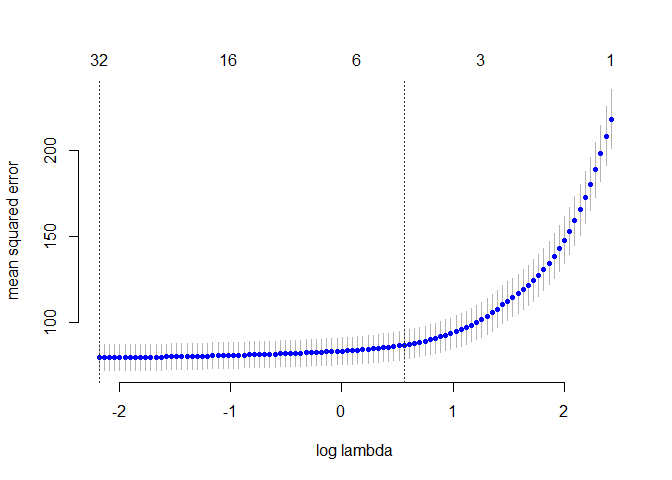

Question 1. Predictive model for Green Buildings
================================================

Using the data on 7,984 commercial rental properties from the United
States, the goal is to build a predictive model for rental income per
square foot. To build the model we have several key features of each
property such as size in square foot, leasing rate, number of stories,
amenities, among others. We also have information about building’s
“neiborhood”, weather in the area and kind of contract that the property
offers. Beyond the amount of variables we have, we are specially
interested in quantifying the average change in rental income per square
foot associated with green certification, holding other features of the
building constant. In this dataset, 685 properties have been awarded
either LEED or EnergyStar certification as a green building.

To adress this problem we use different approachs we have seen in class.
The first approach is from the point of view of linear models, including
model regularization techniques and stepwise selection. In the second
approach we use a Lasso regression model and cross validation, to try to
find a best model. Finally we implement tree models, random forest and
boosting.

Approach \#1 Linear models and stepwise selection
-------------------------------------------------

To start we cleaned our database eliminating the properties that are
without occupation and the entries with missing data. After that, we
proceed creating a model that include variables we consider are relevant
to explain the rent price. It is important to remark that we decided
working with the variable that summarize green rating which takes value
of 1 if the property has at least one green certifification and zero
otherwise. Then, the first model we fitted is a linear one, called
manual, that include most of the variables available, we mainly dropped
variables that seemed to do not explain to much in our model. These
variableswere property ID, precipitation days, cold and hot degree days,
however we included total degrees days. After the first model, we
regress a second one with the same varianles but now considering all the
interactions between covariates. Having our two first models, the next
step was working with the function step to look for a model that
improves the AIC of the previous ones. To do that we created a null
model and ran the function step to find a better model based on the
scope of variables of the two originals models. After we got the new 2
models, we splitted up our sample in a train and test subsamples. To
validate our models we generated out of sample RMSEs boostrapping our
data.

**Table 1. RSME, AIC and BIC for linear models**
<table>
<thead>
<tr>
<th style="text-align:left;">
</th>
<th style="text-align:right;">
RMSE
</th>
<th style="text-align:right;">
AIC
</th>
<th style="text-align:right;">
BIC
</th>
<th style="text-align:right;">
DF
</th>
</tr>
</thead>
<tbody>
<tr>
<td style="text-align:left;">
Model 1: Manual built
</td>
<td style="text-align:right;">
9.54
</td>
<td style="text-align:right;">
56261.86
</td>
<td style="text-align:right;">
56386.87
</td>
<td style="text-align:right;">
18
</td>
</tr>
<tr>
<td style="text-align:left;">
Model 2: Interactions
</td>
<td style="text-align:right;">
9.25
</td>
<td style="text-align:right;">
55658.25
</td>
<td style="text-align:right;">
56609.70
</td>
<td style="text-align:right;">
137
</td>
</tr>
<tr>
<td style="text-align:left;">
Model 3: Manual built + step
</td>
<td style="text-align:right;">
9.53
</td>
<td style="text-align:right;">
56258.53
</td>
<td style="text-align:right;">
56362.70
</td>
<td style="text-align:right;">
15
</td>
</tr>
<tr>
<td style="text-align:left;">
Model 4: Interactions + step
</td>
<td style="text-align:right;">
9.24
</td>
<td style="text-align:right;">
55690.84
</td>
<td style="text-align:right;">
55920.03
</td>
<td style="text-align:right;">
33
</td>
</tr>
</tbody>
</table>

Table 1 summarizes the information of the four linear models we built.
we can see that the model with the lowest RMSE is the model 4 generated
by the step function based on the all interactions model. We can also
see that this model has the second lowest AIC, only improved by model 2.
However, we decided to include BIC criteria too, since it penalizes the
number of coefficientes included in a model. With this criteria, the
model 4 is the better, considering it is a more parsimonious model than
model 2.

Approach \#2 Lasso Regression: Variable Selection and Regularization
--------------------------------------------------------------------

The second approach is from the point of view of lasso regression.
Working with the same data as the linear models, the only extraa step we
needed to take before start with lasso models was the creation of sparse
matrices for training and testing subsamples. The sparse matrices
included the same variables of our manual linear model plus all the
interactions, the last in order to have and equivalent scope of linear
models. We went straight to use the cross validation function to find
the best lasso model to predict rent. The cross validation function
finds the lasso model tha minimized the lambda and drops all the
coefficients that are close to be zero. We know when lambda is close to
zero the betas found by lasso are essentially the least squares
estimates. Thus, we implemented a cross validation lasso regression
considering 10 folds and bostrapped again the process several times.

**Table 2. Evaluation of Lasso Model**
<table>
<thead>
<tr>
<th style="text-align:left;">
</th>
<th style="text-align:right;">
Model 5: Lasso Model
</th>
</tr>
</thead>
<tbody>
<tr>
<td style="text-align:left;">
RMSE
</td>
<td style="text-align:right;">
9.33
</td>
</tr>
<tr>
<td style="text-align:left;">
Log Lambda
</td>
<td style="text-align:right;">
-2.16
</td>
</tr>
<tr>
<td style="text-align:left;">
Number of coefficients
</td>
<td style="text-align:right;">
30.00
</td>
</tr>
</tbody>
</table>

Table 2 contains the average results of the lasso cross validation. The
model found has in average a log lambda of -2.1649544 and in average
includes 30 coefficients. However, the findings suggests that the lasso
selected model does not improve the best linear model built in the
previous section according with the boostrapped out of sample RSME
computed. In graph 1, we show the evolution of a lasso regression for
one case. We can appreciate how lasso approach found the minimum RMSE in
a number of coefficients similar to the coefficients included in the
best linear regression. The last reinforces that the linear model could
be a good predictor of rent price.

**Graph 1. Lasso model: Errror vs Log Lambda**

Approach \#3 Tree Models, Random Forest and Boosting
----------------------------------------------------

As a final approach, we work with tree models, random forest and
boosting. First we worked with a simple tree model to predict rent
price. About trees we known that they are good to manipulate large
dataset and to ignore redundant data, we know they are not the best
model to prediction though. A full tree was grown on the training set,
with splitting continuing until a minimum bucket size of 5 was reached.
This tree was pruned, and the tree size was chosen by 10-fold
cross-validation. we repeated this approach several times by data
boostrapping to generate out of sample RMSEs. After the simple tree, we
proceeded with a random forest. This method fit many large trees to
bootstrap-resampled versions of the training data by relevance. We
created 500 trees by random forest including a minimum of 5 features per
bucket, and later we compute the out of sample RMSE. Finally, we
performed a boosting model, that mainly fits several trees to reweighted
versions of the training dataset and then classifies by weighted
majority relevance. We fitted 5000 trees by this method with a shrinkage
factor of 0.05.

**Table 3. Tree, Random Forest and Boosting comparative**
<table>
<thead>
<tr>
<th style="text-align:left;">
</th>
<th style="text-align:right;">
RMSE
</th>
</tr>
</thead>
<tbody>
<tr>
<td style="text-align:left;">
Model 6: Tree model
</td>
<td style="text-align:right;">
9.21
</td>
</tr>
<tr>
<td style="text-align:left;">
Model 7:Random Forest
</td>
<td style="text-align:right;">
5.81
</td>
</tr>
<tr>
<td style="text-align:left;">
Model 8: Boosting
</td>
<td style="text-align:right;">
8.19
</td>
</tr>
</tbody>
</table>

Table 3 summarizes the RMSE of the last tree model fitted. We can see
that when the simple tree model does not improve the previous models,
the random forest model and the boosting model certainly outperfom all
the models. The best model we have built to predict the rent price per
square foot so far is the random forest model with the least out of
sample RMSE. However, now we face the problem that random forest model
are certainly not interpretable and we want to know the partial effect
of being a green building over price. Despite of this limitation random
forest models allow us to get a importance meaure of each variable in
the model.It just adds up how much the error decreases every time a
variable is used in a split. This information is contained in graph 2.
we can observe that the most importan variable is the rent price in the
cluster where our property is located, followed by size and so on.

**Graph 2. Varibale importance (Random Forest)**

Concluding Remarks
------------------

With data on 7,984 commercial rental properties from the United States,
we built eight models to predict the rent price per square foot. The
approaches implemented varie from linear models, going throug step
selection, lasso regression until to tree models, random forest and
boosting. The out of sample results suggets that the model with the
lowest error is the random forest model with a RMSE of 5.8129614. We
also were requested to find the the average change in rental income per
square foot associated with green certification. Given the barrier we
have to get this kind of interpretation from a random forest model. We
computed the average marginal effect of being a green building from the
best linear model we fitted (Model 4). The results suggest that having a
green certification leads an increasing in 1.307 dollars per square foot
in rent price. This result makes sense since green building properties
have positive features such as lower energy compsumption levels,
variable that according with our random forest model is important to
explain rent price.
