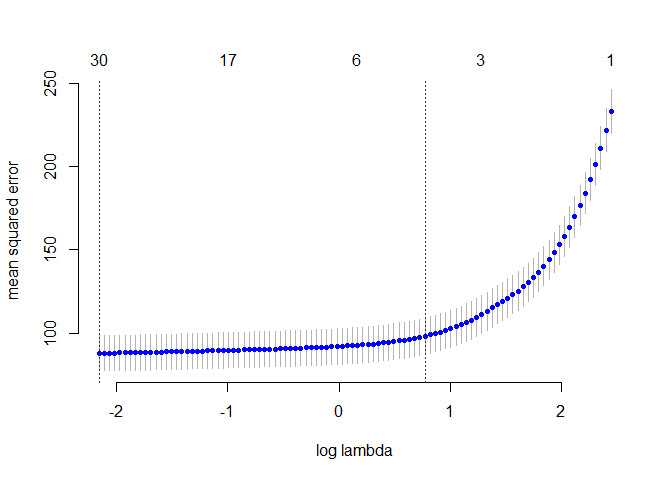
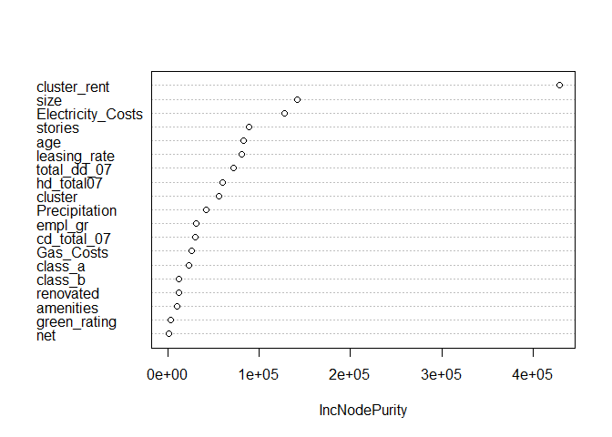
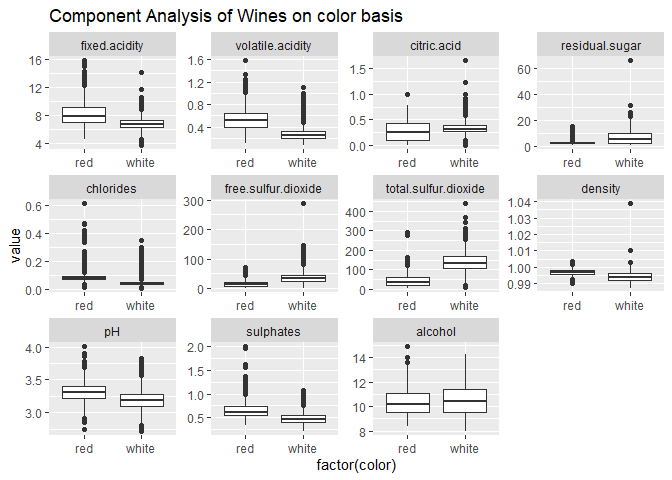
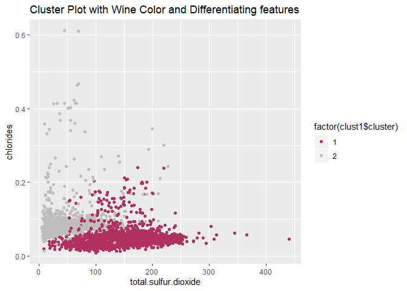
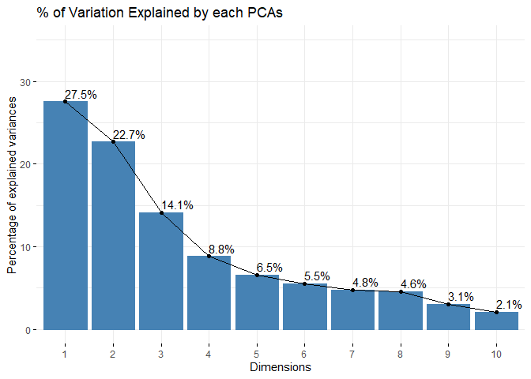
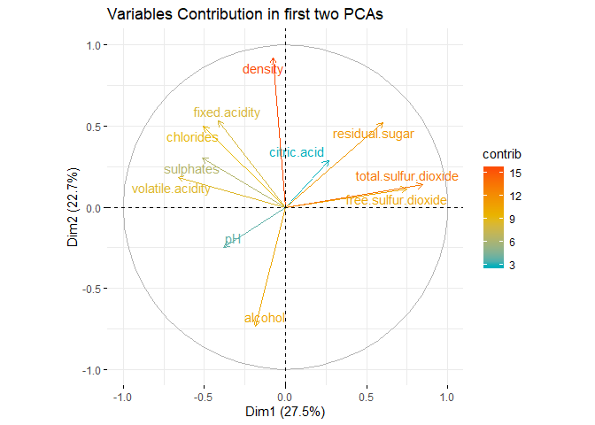
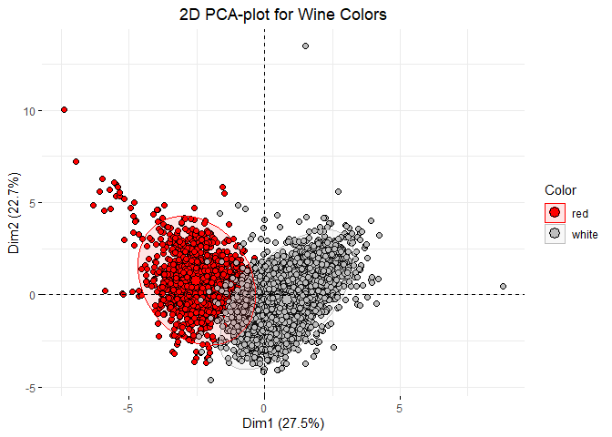
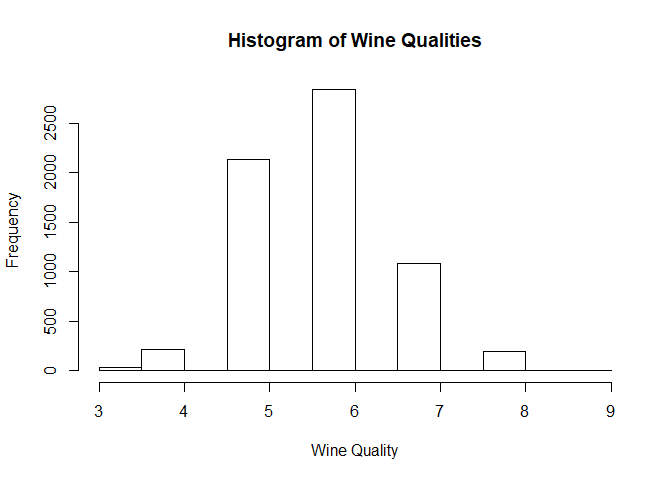
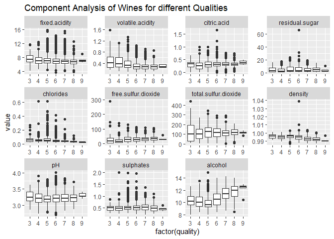

Assignment 3
============

Group Members: Clark Granger, Zachary Carlson and Zargham Khan
==============================================================

Question 1. Predictive model for Green Buildings
------------------------------------------------

Using the data on 7,984 commercial rental properties from the United
States, the goal is to build a predictive model for rental income per
square foot. To build the model we have several key features of each
property such as size in square foot, leasing rate, number of stories,
amenities, among others. We also have information about building’s
“neiborhood”, weather in the area and kind of contract that the property
offers. Beyond the amount of variables we have, we are specially
interested in quantifying the average change in rental income per square
foot associated with green certification, holding other features of the
building constant. In this dataset, 685 properties have been awarded
either LEED or EnergyStar certification as a green building.

To adress this problem we use different approachs we have seen in class.
The first approach is from the point of view of linear models, including
model regularization techniques and stepwise selection. In the second
approach we use a Lasso regression model and cross validation, to try to
find a best model. Finally we implement tree models, random forest and
boosting.

### Approach \#1 Linear models and stepwise selection

To start we cleaned our database eliminating the properties that are
without occupation and the entries with missing data. After that, we
proceed creating a model that include variables we consider are relevant
to explain the rent price. It is important to remark that we decided
working with the variable that summarize green rating which takes value
of 1 if the property has at least one green certifification and zero
otherwise. Then, the first model we fitted is a linear one, called
manual, that include most of the variables available, we mainly dropped
variables that seemed to do not explain to much in our model. These
variableswere property ID, precipitation days, cold and hot degree days,
however we included total degrees days. After the first model, we
regress a second one with the same varianles but now considering all the
interactions between covariates. Having our two first models, the next
step was working with the function step to look for a model that
improves the AIC of the previous ones. To do that we created a null
model and ran the function step to find a better model based on the
scope of variables of the two originals models. After we got the new 2
models, we splitted up our sample in a train and test subsamples. To
validate our models we generated out of sample RMSEs boostrapping our
data.

**Table 1. RSME, AIC and BIC for linear models**

|                              |  RMSE|       AIC|       BIC|   DF|
|------------------------------|-----:|---------:|---------:|----:|
| Model 1: Manual built        |  9.56|  56261.86|  56386.87|   18|
| Model 2: Interactions        |  9.24|  55658.25|  56609.70|  137|
| Model 3: Manual built + step |  9.56|  56258.53|  56362.70|   15|
| Model 4: Interactions + step |  9.22|  55690.84|  55920.03|   33|

Table 1 summarizes the information of the four linear models we built.
we can see that the model with the lowest RMSE is the model 4 generated
by the step function based on the all interactions model. We can also
see that this model has the second lowest AIC, only improved by model 2.
However, we decided to include BIC criteria too, since it penalizes the
number of coefficientes included in a model. With this criteria, the
model 4 is the better, considering it is a more parsimonious model than
model 2.

### Approach \#2 Lasso Regression: Variable Selection and Regularization

The second approach is from the point of view of lasso regression.
Working with the same data as the linear models, the only extraa step we
needed to take before start with lasso models was the creation of sparse
matrices for training and testing subsamples. The sparse matrices
included the same variables of our manual linear model plus all the
interactions, the last in order to have and equivalent scope of linear
models. We went straight to use the cross validation function to find
the best lasso model to predict rent. The cross validation function
finds the lasso model tha minimized the lambda and drops all the
coefficients that are close to be zero. We know when lambda is close to
zero the betas found by lasso are essentially the least squares
estimates. Thus, we implemented a cross validation lasso regression
considering 10 folds and bostrapped again the process several times.

**Table 2. Evaluation of Lasso Model**

|                        |  Model 5: Lasso Model|
|------------------------|---------------------:|
| RMSE                   |                  9.34|
| Log Lambda             |                 -2.17|
| Number of coefficients |                 31.80|

Table 2 contains the average results of the lasso cross validation. The
model found has in average a log lambda of -2.1682685 and in average
includes 31.8 coefficients. However, the findings suggests that the
lasso selected model does not improve the best linear model built in the
previous section according with the boostrapped out of sample RSME
computed. In graph 1, we show the evolution of a lasso regression for
one case. We can appreciate how lasso approach found the minimum RMSE in
a number of coefficients similar to the coefficients included in the
best linear regression. The last reinforces that the linear model could
be a good predictor of rent price.

**Graph 1. Lasso model: Errror vs Log Lambda**

### Approach \#3 Tree Models, Random Forest and Boosting

As a final approach, we work with tree models, random forest and
boosting. First we worked with a simple tree model to predict rent
price. About trees we known that they are good to manipulate large
dataset and to ignore redundant data, we know they are not the best
model to prediction though. A full tree was grown on the training set,
with splitting continuing until a minimum bucket size of 5 was reached.
This tree was pruned, and the tree size was chosen by 10-fold
cross-validation. we repeated this approach several times by data
boostrapping to generate out of sample RMSEs. After the simple tree, we
proceeded with a random forest. This method fit many large trees to
bootstrap-resampled versions of the training data by relevance. We
created 500 trees by random forest including a minimum of 5 features per
bucket, and later we compute the out of sample RMSE. Finally, we
performed a boosting model, that mainly fits several trees to reweighted
versions of the training dataset and then classifies by weighted
majority relevance. We fitted 5000 trees by this method with a shrinkage
factor of 0.05.

**Table 3. Tree, Random Forest and Boosting comparative**

|                       |  RMSE|
|-----------------------|-----:|
| Model 6: Tree model   |  9.12|
| Model 7:Random Forest |  6.27|
| Model 8: Boosting     |  8.65|

Table 3 summarizes the RMSE of the last tree model fitted. We can see
that when the simple tree model does not improve the previous models,
the random forest model and the boosting model certainly outperfom all
the models. The best model we have built to predict the rent price per
square foot so far is the random forest model with the least out of
sample RMSE. However, now we face the problem that random forest model
are certainly not interpretable and we want to know the partial effect
of being a green building over price. Despite of this limitation random
forest models allow us to get a importance meaure of each variable in
the model.It just adds up how much the error decreases every time a
variable is used in a split. This information is contained in graph 2.
we can observe that the most importan variable is the rent price in the
cluster where our property is located, followed by size and so on.

**Graph 2. Varibale importance (Random Forest)**

### Concluding Remarks

With data on 7,984 commercial rental properties from the United States,
we built eight models to predict the rent price per square foot. The
approaches implemented varie from linear models, going throug step
selection, lasso regression until to tree models, random forest and
boosting. The out of sample results suggets that the model with the
lowest error is the random forest model with a RMSE of 6.2696597. We
also were requested to find the the average change in rental income per
square foot associated with green certification. Given the barrier we
have to get this kind of interpretation from a random forest model. We
computed the average marginal effect of being a green building from the
best linear model we fitted (Model 4). The results suggest that having a
green certification leads an increasing in 1.307 dollars per square foot
in rent price. This result makes sense since green building properties
have positive features such as lower energy compsumption levels,
variable that according with our random forest model is important to
explain rent price.

Question. 2: What causes what?
------------------------------

### Part A.

Running a simple regression of crime on police will give us correlation
between these two variables but it will not help us identify if one
causes the other. It might be a case that crime affects police number
because police numbers are apportioned by authority based on
predetermined crime rates of areas. So a simple regression will be
spurious and will not help us identify if higher crime leads to higher
police number or vice versa.

Even if the casual effect of police is negative but the regression might
pick postive correlation due to high police in high crime areas which
might lead people to infer that higher police causes higher crime rate.
So a regression co-efficient always does not show what causes what. It
just gives us correlation between two variables.

### Part B.

The researchers from UPenn came up with a technqiue called intrumental
variable in which they use an exogenous shock to police numbers in
district one of Washington DC. They came up with a dummy variable of
High Alert for days when a high alert was issued due to potential
terrorist threat and that led to a higher than usual number of police in
the streets of district one. This means that they came up with a
variable that only affected the number of police numbers in district one
without having any affect on crime rate.

Through the increase in police number due to high alert, the researchers
try to look at the casual effect of higher police on crime rate. They
compare the crime rate of district one on high alert days with other
adjoining districts where police number on streets remain unchanged. So
district one had more police on these days as compared to other
districts.

Table 2 gives us coeffcient for high alert days which can be interpreted
as a reduction of average 7.3 crimes on high alert days as compared to
usual or normal days. This shows that high number of police on high
alert days lead to a decrease in crime numbers.

### Part C

The main purpose of including this variable is to control for any change
in number of public and tourists on high alert days. This approach helps
in negating the assumption that crime rate decreases on high alert days
because there are fewer people/ tourists on streets and so less
oppurtunity for crime. The table shows that even after controlling for
metro ridership, we see only a small change in coefficient for high
alert day. Thus, high alert is only affecting crime through higher
number of police and not through any other means.

### Part D

From the above regression, we can see that researchers are comparing
crime numbers in district one with other districts on high alert days.
If only district one witness an increase in police on high alert days,
then the decrease in crime rate in district one should be significantly
higher than other districts. The table clearly shows this as we look at
(Highalert\*District one) coefficient that shows a statistically
significant decrease of average 2.8 crimes on high alert days in
district one as compared to other districts of Washington that do not
show any significant change. The model also includes days fixed effects,
day of the week dummies, district fixed effects and district offense
fixed effects to isolate the casual effect of police on crime number.

Question.3: Clustering and PCA - Wines
--------------------------------------

In this question we are provided with a dataset of more than six
thousand different wines with their 11 chemical properties and two
outcome variables quality and color. The task at hand is to employ
unsupervised learning techniques and classify these wines into groups/
clusters based on color and quality.

We start with classfication of wines based on its color. We have two
colors; red and white. We plot boxplots of wine color against their
chemical properties to see which properties are different across these
two colors. We see that amount of chlorides, total sulfur dioxide and
volatile acidity are major variables that have different distribution
for red and white wines.

### Clustering Kmeans and Kmeanspp

We run a simple kmeans clustering technique and chose centers as 2
because we already know how many groups we have to classify our data
into i.e. 2 colors. The result of kmeans clustering in the table below
shows that it separates wines based on its color quite successfully.
Only 24+68 = 92 wines out of 6,497 wines have been misclassified by this
method. The error rate is 1.416 percent.

<table style="width:36%;">
<caption>Wine Color on Vertical axis vs Cluster group on Horizontal axis for kmeans Clustering</caption>
<colgroup>
<col style="width: 16%" />
<col style="width: 9%" />
<col style="width: 9%" />
</colgroup>
<thead>
<tr class="header">
<th style="text-align: center;"> </th>
<th style="text-align: center;">1</th>
<th style="text-align: center;">2</th>
</tr>
</thead>
<tbody>
<tr class="odd">
<td style="text-align: center;"><strong>red</strong></td>
<td style="text-align: center;">24</td>
<td style="text-align: center;">1575</td>
</tr>
<tr class="even">
<td style="text-align: center;"><strong>white</strong></td>
<td style="text-align: center;">4830</td>
<td style="text-align: center;">68</td>
</tr>
</tbody>
</table>

We also plot clusters along with wine colors on a graph with two major
differentiating chemical properties. White wines have more total sulfur
dioxide content whereas red wines have more chlordies.

We also employ kmeans++ clustering and it gives us the same result as
kmeans clustering which can be seen in the table below.

<table style="width:36%;">
<caption>Wine Color on Vertical axis vs Cluster group on Horizontal axis for kmeans++ Clustering</caption>
<colgroup>
<col style="width: 16%" />
<col style="width: 9%" />
<col style="width: 9%" />
</colgroup>
<thead>
<tr class="header">
<th style="text-align: center;"> </th>
<th style="text-align: center;">1</th>
<th style="text-align: center;">2</th>
</tr>
</thead>
<tbody>
<tr class="odd">
<td style="text-align: center;"><strong>red</strong></td>
<td style="text-align: center;">24</td>
<td style="text-align: center;">1575</td>
</tr>
<tr class="even">
<td style="text-align: center;"><strong>white</strong></td>
<td style="text-align: center;">4830</td>
<td style="text-align: center;">68</td>
</tr>
</tbody>
</table>

However when using hiearchial clustering, we do not see see clustering
based on color of wines. By cutting tree at 2 we get almost all wines
sorted into one cluster. Even with cutting tress at 5 or 10 levels, we
dont see any balance in the distribution of wines into different
clusters. It looks to be a very uneven hiearchial clustering. We try all
distance measuring approaches but they all give similar results.

<table style="width:32%;">
<caption>Wine Color on Vertical axis vs Cluster group on Horizontal axis for Hiearchial Clustering</caption>
<colgroup>
<col style="width: 16%" />
<col style="width: 9%" />
<col style="width: 5%" />
</colgroup>
<thead>
<tr class="header">
<th style="text-align: center;"> </th>
<th style="text-align: center;">1</th>
<th style="text-align: center;">2</th>
</tr>
</thead>
<tbody>
<tr class="odd">
<td style="text-align: center;"><strong>red</strong></td>
<td style="text-align: center;">1599</td>
<td style="text-align: center;">0</td>
</tr>
<tr class="even">
<td style="text-align: center;"><strong>white</strong></td>
<td style="text-align: center;">4897</td>
<td style="text-align: center;">1</td>
</tr>
</tbody>
</table>

### PCA

We now use PCA and transform our data accordingly. We get 11 PCAs which
are plotted in scree plot below. If we look at first PCA, we see that
the main contributers of variation are total sulfur dioxide,chlorides
and volatile acidity which are also the main variables that
differentiate red from white wines. Thus first PCA is capturing
variations between red and white wines. Overall, first 6 PCAs explain
85% of total variation in our dataset of wines.

We plot our graph for first two PCAs and color the points with color of
wines. We can clearly see that PCA1 on the x-axis is differentiating
white wines from red wines. So we can say that PCA1 is explaining color
variation of wines.

Now, we use our principal components to run kmeans clustering again to
see if we get any better performance than simple kmeans clustering on
original scaled data. With clustering on PCAs we see a further reduction
in our classification error. Now we only have 37 wines misclassified
which equals to an error rate of 0.5%. We can also run a logit model on
PCAs but since the question asks us to use only unsupervised learning,
we stuck with kmeans clustering.

<table style="width:36%;">
<caption>Wine Color on Vertical axis vs Cluster group on Horizontal axis for kmeans Clustering on PCA</caption>
<colgroup>
<col style="width: 16%" />
<col style="width: 9%" />
<col style="width: 9%" />
</colgroup>
<thead>
<tr class="header">
<th style="text-align: center;"> </th>
<th style="text-align: center;">1</th>
<th style="text-align: center;">2</th>
</tr>
</thead>
<tbody>
<tr class="odd">
<td style="text-align: center;"><strong>red</strong></td>
<td style="text-align: center;">17</td>
<td style="text-align: center;">1582</td>
</tr>
<tr class="even">
<td style="text-align: center;"><strong>white</strong></td>
<td style="text-align: center;">4878</td>
<td style="text-align: center;">20</td>
</tr>
</tbody>
</table>

From our results we can confidently say that kmeans clustering with PCA
gives us a better result in classifying wines based on its color as
compared to using clustering on original scaled data.

### Sorting of Wine based on its Quality

We now try to sort these wines based on their quality. In the data, we
have wines with quality ranging from 3 to 9 on a numerical scale. Most
of these wines are 5,6 and 7 quality wines.

We run the same kmeans clustering but with centers = 7 as now we need to
sort wines into 7 clusters/ groups. The confusion matrix shows that
there is no pattern of sorting based on quality of wine. For 6 quality
wines, the alogrithm places it evenly in almost all clusters. This shows
that kmeans is not picking up the differences in wine quality
succesfully.

<table style="width:69%;">
<caption>Wine Quality on Vertical axis vs Cluster group on Horizontal axis for kmeans clustering on original scaled data</caption>
<colgroup>
<col style="width: 12%" />
<col style="width: 8%" />
<col style="width: 8%" />
<col style="width: 8%" />
<col style="width: 8%" />
<col style="width: 8%" />
<col style="width: 6%" />
<col style="width: 8%" />
</colgroup>
<thead>
<tr class="header">
<th style="text-align: center;"> </th>
<th style="text-align: center;">1</th>
<th style="text-align: center;">2</th>
<th style="text-align: center;">3</th>
<th style="text-align: center;">4</th>
<th style="text-align: center;">5</th>
<th style="text-align: center;">6</th>
<th style="text-align: center;">7</th>
</tr>
</thead>
<tbody>
<tr class="odd">
<td style="text-align: center;"><strong>3</strong></td>
<td style="text-align: center;">4</td>
<td style="text-align: center;">7</td>
<td style="text-align: center;">7</td>
<td style="text-align: center;">2</td>
<td style="text-align: center;">5</td>
<td style="text-align: center;">1</td>
<td style="text-align: center;">4</td>
</tr>
<tr class="even">
<td style="text-align: center;"><strong>4</strong></td>
<td style="text-align: center;">21</td>
<td style="text-align: center;">63</td>
<td style="text-align: center;">24</td>
<td style="text-align: center;">27</td>
<td style="text-align: center;">64</td>
<td style="text-align: center;">2</td>
<td style="text-align: center;">15</td>
</tr>
<tr class="odd">
<td style="text-align: center;"><strong>5</strong></td>
<td style="text-align: center;">77</td>
<td style="text-align: center;">471</td>
<td style="text-align: center;">655</td>
<td style="text-align: center;">269</td>
<td style="text-align: center;">446</td>
<td style="text-align: center;">20</td>
<td style="text-align: center;">200</td>
</tr>
<tr class="even">
<td style="text-align: center;"><strong>6</strong></td>
<td style="text-align: center;">548</td>
<td style="text-align: center;">350</td>
<td style="text-align: center;">640</td>
<td style="text-align: center;">475</td>
<td style="text-align: center;">549</td>
<td style="text-align: center;">9</td>
<td style="text-align: center;">265</td>
</tr>
<tr class="odd">
<td style="text-align: center;"><strong>7</strong></td>
<td style="text-align: center;">446</td>
<td style="text-align: center;">43</td>
<td style="text-align: center;">122</td>
<td style="text-align: center;">189</td>
<td style="text-align: center;">137</td>
<td style="text-align: center;">1</td>
<td style="text-align: center;">141</td>
</tr>
<tr class="even">
<td style="text-align: center;"><strong>8</strong></td>
<td style="text-align: center;">97</td>
<td style="text-align: center;">2</td>
<td style="text-align: center;">22</td>
<td style="text-align: center;">31</td>
<td style="text-align: center;">27</td>
<td style="text-align: center;">0</td>
<td style="text-align: center;">14</td>
</tr>
<tr class="odd">
<td style="text-align: center;"><strong>9</strong></td>
<td style="text-align: center;">4</td>
<td style="text-align: center;">0</td>
<td style="text-align: center;">0</td>
<td style="text-align: center;">0</td>
<td style="text-align: center;">1</td>
<td style="text-align: center;">0</td>
<td style="text-align: center;">0</td>
</tr>
</tbody>
</table>

We then run kmeans clustering on principal components and sort data into
7 clusters. The consfusion matrix does not look much different than
simple kmeans clustering. So even with PCA we are not able to sort wines
based on their quality.

<table style="width:69%;">
<caption>Wine Quality on Vertical axis vs Cluster group on Horizontal axis for kmeans Clustering on PCA</caption>
<colgroup>
<col style="width: 12%" />
<col style="width: 6%" />
<col style="width: 8%" />
<col style="width: 8%" />
<col style="width: 8%" />
<col style="width: 8%" />
<col style="width: 8%" />
<col style="width: 8%" />
</colgroup>
<thead>
<tr class="header">
<th style="text-align: center;"> </th>
<th style="text-align: center;">1</th>
<th style="text-align: center;">2</th>
<th style="text-align: center;">3</th>
<th style="text-align: center;">4</th>
<th style="text-align: center;">5</th>
<th style="text-align: center;">6</th>
<th style="text-align: center;">7</th>
</tr>
</thead>
<tbody>
<tr class="odd">
<td style="text-align: center;"><strong>3</strong></td>
<td style="text-align: center;">3</td>
<td style="text-align: center;">7</td>
<td style="text-align: center;">5</td>
<td style="text-align: center;">3</td>
<td style="text-align: center;">2</td>
<td style="text-align: center;">4</td>
<td style="text-align: center;">6</td>
</tr>
<tr class="even">
<td style="text-align: center;"><strong>4</strong></td>
<td style="text-align: center;">4</td>
<td style="text-align: center;">65</td>
<td style="text-align: center;">29</td>
<td style="text-align: center;">15</td>
<td style="text-align: center;">24</td>
<td style="text-align: center;">9</td>
<td style="text-align: center;">70</td>
</tr>
<tr class="odd">
<td style="text-align: center;"><strong>5</strong></td>
<td style="text-align: center;">53</td>
<td style="text-align: center;">611</td>
<td style="text-align: center;">139</td>
<td style="text-align: center;">361</td>
<td style="text-align: center;">324</td>
<td style="text-align: center;">153</td>
<td style="text-align: center;">497</td>
</tr>
<tr class="even">
<td style="text-align: center;"><strong>6</strong></td>
<td style="text-align: center;">52</td>
<td style="text-align: center;">722</td>
<td style="text-align: center;">704</td>
<td style="text-align: center;">533</td>
<td style="text-align: center;">225</td>
<td style="text-align: center;">266</td>
<td style="text-align: center;">334</td>
</tr>
<tr class="odd">
<td style="text-align: center;"><strong>7</strong></td>
<td style="text-align: center;">2</td>
<td style="text-align: center;">199</td>
<td style="text-align: center;">525</td>
<td style="text-align: center;">140</td>
<td style="text-align: center;">29</td>
<td style="text-align: center;">143</td>
<td style="text-align: center;">41</td>
</tr>
<tr class="even">
<td style="text-align: center;"><strong>8</strong></td>
<td style="text-align: center;">0</td>
<td style="text-align: center;">33</td>
<td style="text-align: center;">110</td>
<td style="text-align: center;">28</td>
<td style="text-align: center;">7</td>
<td style="text-align: center;">13</td>
<td style="text-align: center;">2</td>
</tr>
<tr class="odd">
<td style="text-align: center;"><strong>9</strong></td>
<td style="text-align: center;">0</td>
<td style="text-align: center;">0</td>
<td style="text-align: center;">4</td>
<td style="text-align: center;">1</td>
<td style="text-align: center;">0</td>
<td style="text-align: center;">0</td>
<td style="text-align: center;">0</td>
</tr>
</tbody>
</table>

We try to group wines into two groups; high quality and low quality by
classifying wines with quality 6 and above as high quality and the rest
as low quality wines. We run kmeans clustering again but the results are
not encouraging as we see a very high error rate.

<table style="width:35%;">
<colgroup>
<col style="width: 15%" />
<col style="width: 9%" />
<col style="width: 9%" />
</colgroup>
<thead>
<tr class="header">
<th style="text-align: center;"> </th>
<th style="text-align: center;">1</th>
<th style="text-align: center;">2</th>
</tr>
</thead>
<tbody>
<tr class="odd">
<td style="text-align: center;"><strong>High</strong></td>
<td style="text-align: center;">3258</td>
<td style="text-align: center;">855</td>
</tr>
<tr class="even">
<td style="text-align: center;"><strong>Low</strong></td>
<td style="text-align: center;">1596</td>
<td style="text-align: center;">788</td>
</tr>
</tbody>
</table>

This clearly shows that the clustering and PCA techniques are not able
to sort or identify wines based on its quality. It seems that our
approach of euclidean distance measurement is not capturing the
differenes in quality of wines. Looking at boxplots of quality against
different chemical properties, we do not see much variations for
chemical properties across different qualities of wines. Probably the
quality of wine is not particularly linked to these 11 chemical
properties and hence failure of clustering and PCA to distinguish it.

