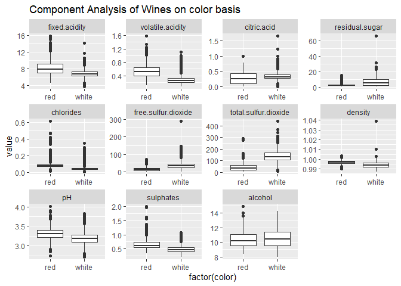
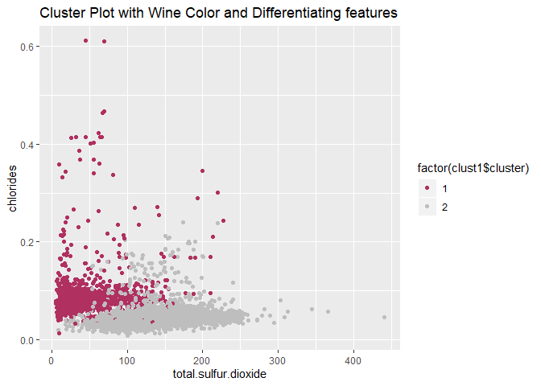
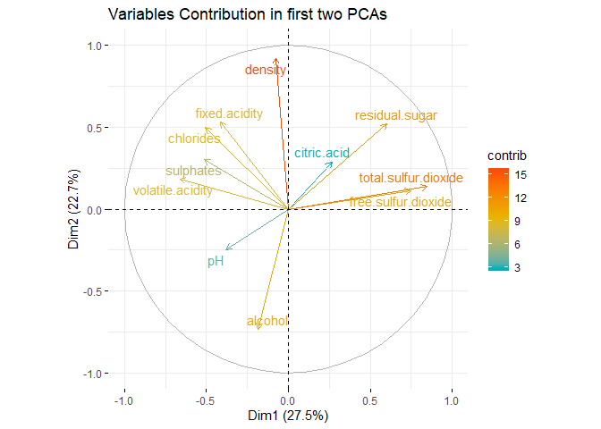

Question. 2: What causes what?
------------------------------

### Part A.

Running a simple regression of crime on police will give us correlation
between these two variables but it will not help us identify if one
causes the other. It might be a case that crime affects police number
because police numbers are apportioned by authority based on
predetermined crime rates of areas. So a simple regression will be
spurious and will not help us identify if higher crime leads to higher
police number or vice versa.

Even if the casual effect of police is negative but the regression might
pick postive correlation due to high police in high crime areas which
might lead people to infer that higher police causes higher crime rate.
So a regression co-efficient always does not show what causes what. It
just gives us correlation between two variables.

### Part B.

The researchers from UPenn came up with a technqiue called intrumental
variable in which they use an exogenous shock to police numbers in
district one of Washington DC. They came up with a dummy variable of
High Alert for days when a high alert was issued due to potential
terrorist threat and that led to a higher than usual number of police in
the streets of district one. This means that they came up with a
variable that only affected the number of police numbers in district one
without having any affect on crime rate.

Through the increase in police number due to high alert, the researchers
try to look at the casual effect of higher police on crime rate. They
compare the crime rate of district one on high alert days with other
adjoining districts where police number on streets remain unchanged. So
district one had more police on these days as compared to other
districts.

Table 2 gives us coeffcient for high alert days which can be interpreted
as a reduction of average 7.3 crimes on high alert days as compared to
usual or normal days. This shows that high number of police on high
alert days lead to a decrease in crime numbers.

### Part C

The main purpose of including this variable is to control for any change
in number of public and tourists on high alert days. This approach helps
in negating the assumption that crime rate decreases on high alert days
because there are fewer people/ tourists on streets and so less
oppurtunity for crime. The table shows that even after controlling for
metro ridership, we see only a small change in coefficient for high
alert day. Thus, high alert is only affecting crime through higher
number of police and not through any other means.

### Part D

From the above regression, we can see that researchers are comparing
crime numbers in district one with other districts on high alert days.
If only district one witness an increase in police on high alert days,
then the decrease in crime rate in district one should be significantly
higher than other districts. The table clearly shows this as we look at
(Highalert\*District one) coefficient that shows a statistically
significant decrease of average 2.8 crimes on high alert days in
district one as compared to other districts of Washington that do not
show any significant change. The model also includes days fixed effects,
day of the week dummies, district fixed effects and district offense
fixed effects to isolate the casual effect of police on crime number.

Question.3: Clustering and PCA - Wines
--------------------------------------

In this question we are provided with a dataset of more than six
thousand different wines with their 11 chemical properties and two
outcome variables quality and color. The task at hand is to employ
unsupervised learning techniques and classify these wines into groups/
clusters based on color and quality.

We start with classfication of wines based on its color. We have two
colors; red and white. We plot boxplots of wine color against their
chemical properties to see which properties are different across these
two colors. We see that amount of chlorides, total sulfur dioxide and
volatile acidity are major variables that have different distribution
for red and white wines.

### Clustering Kmeans and Kmeanspp

We run a simple kmeans clustering technique and chose centers as 2
because we already know how many groups we have to classify our data
into i.e. 2 colors. The result of kmeans clustering in the table below
shows that it separates wines based on its color quite successfully.
Only 24+68 = 92 wines out of 6,497 wines have been misclassified by this
method. The error rate is 1.416 percent.

<table style="width:36%;">
<caption>Wine Color on Vertical axis vs Cluster group on Horizontal axis for kmeans Clustering</caption>
<colgroup>
<col style="width: 16%" />
<col style="width: 9%" />
<col style="width: 9%" />
</colgroup>
<thead>
<tr class="header">
<th style="text-align: center;"> </th>
<th style="text-align: center;">1</th>
<th style="text-align: center;">2</th>
</tr>
</thead>
<tbody>
<tr class="odd">
<td style="text-align: center;"><strong>red</strong></td>
<td style="text-align: center;">1575</td>
<td style="text-align: center;">24</td>
</tr>
<tr class="even">
<td style="text-align: center;"><strong>white</strong></td>
<td style="text-align: center;">68</td>
<td style="text-align: center;">4830</td>
</tr>
</tbody>
</table>

We also plot clusters along with wine colors on a graph with two major
differentiating chemical properties. White wines have more total sulfur
dioxide content whereas red wines have more chlordies.

We also employ kmeans++ clustering and it gives us the same result as
kmeans clustering which can be seen in the table below.

<table style="width:36%;">
<caption>Wine Color on Vertical axis vs Cluster group on Horizontal axis for kmeans++ Clustering</caption>
<colgroup>
<col style="width: 16%" />
<col style="width: 9%" />
<col style="width: 9%" />
</colgroup>
<thead>
<tr class="header">
<th style="text-align: center;"> </th>
<th style="text-align: center;">1</th>
<th style="text-align: center;">2</th>
</tr>
</thead>
<tbody>
<tr class="odd">
<td style="text-align: center;"><strong>red</strong></td>
<td style="text-align: center;">24</td>
<td style="text-align: center;">1575</td>
</tr>
<tr class="even">
<td style="text-align: center;"><strong>white</strong></td>
<td style="text-align: center;">4830</td>
<td style="text-align: center;">68</td>
</tr>
</tbody>
</table>

However when using hiearchial clustering, we do not see see clustering
based on color of wines. By cutting tree at 2 we get almost all wines
sorted into one cluster. Even with cutting tress at 5 or 10 levels, we
dont see any balance in the distribution of wines into different
clusters. It looks to be a very uneven hiearchial clustering. We try all
distance measuring approaches but they all give similar results.

<table style="width:32%;">
<caption>Wine Color on Vertical axis vs Cluster group on Horizontal axis for Hiearchial Clustering</caption>
<colgroup>
<col style="width: 16%" />
<col style="width: 9%" />
<col style="width: 5%" />
</colgroup>
<thead>
<tr class="header">
<th style="text-align: center;"> </th>
<th style="text-align: center;">1</th>
<th style="text-align: center;">2</th>
</tr>
</thead>
<tbody>
<tr class="odd">
<td style="text-align: center;"><strong>red</strong></td>
<td style="text-align: center;">1599</td>
<td style="text-align: center;">0</td>
</tr>
<tr class="even">
<td style="text-align: center;"><strong>white</strong></td>
<td style="text-align: center;">4897</td>
<td style="text-align: center;">1</td>
</tr>
</tbody>
</table>

### PCA

We now use PCA and transform our data accordingly. We get 11 PCAs which
are plotted in scree plot below. If we look at first PCA, we see that
the main contributers of variation are total sulfur dioxide,chlorides
and volatile acidity which are also the main variables that
differentiate red from white wines. Thus first PCA is capturing
variations between red and white wines. Overall, first 6 PCAs explain
85% of total variation in our dataset of wines.

We plot our graph for first two PCAs and color the points with color of
wines. We can clearly see that PCA1 on the x-axis is differentiating
white wines from red wines. So we can say that PCA1 is explaining color
variation of wines.

Now, we use our principal components to run kmeans clustering again to
see if we get any better performance than simple kmeans clustering on
original scaled data. With clustering on PCAs we see a further reduction
in our classification error. Now we only have 37 wines misclassified
which equals to an error rate of 0.5%. We can also run a logit model on
PCAs but since the question asks us to use only unsupervised learning,
we stuck with kmeans clustering.

    ## Warning: Quick-TRANSfer stage steps exceeded maximum (= 324850)

<table style="width:36%;">
<caption>Wine Color on Vertical axis vs Cluster group on Horizontal axis for kmeans Clustering on PCA</caption>
<colgroup>
<col style="width: 16%" />
<col style="width: 9%" />
<col style="width: 9%" />
</colgroup>
<thead>
<tr class="header">
<th style="text-align: center;"> </th>
<th style="text-align: center;">1</th>
<th style="text-align: center;">2</th>
</tr>
</thead>
<tbody>
<tr class="odd">
<td style="text-align: center;"><strong>red</strong></td>
<td style="text-align: center;">1582</td>
<td style="text-align: center;">17</td>
</tr>
<tr class="even">
<td style="text-align: center;"><strong>white</strong></td>
<td style="text-align: center;">20</td>
<td style="text-align: center;">4878</td>
</tr>
</tbody>
</table>

From our results we can confidently say that kmeans clustering with PCA
gives us a better result in classifying wines based on its color as
compared to using clustering on original scaled data.

### Sorting of Wine based on its Quality

We now try to sort these wines based on their quality. In the data, we
have wines with quality ranging from 3 to 9 on a numerical scale. Most
of these wines are 5,6 and 7 quality wines.

We run the same kmeans clustering but with centers = 7 as now we need to
sort wines into 7 clusters/ groups. The confusion matrix shows that
there is no pattern of sorting based on quality of wine. For 6 quality
wines, the alogrithm places it evenly in almost all clusters. This shows
that kmeans is not picking up the differences in wine quality
succesfully.

    ## Warning: did not converge in 10 iterations

<table style="width:71%;">
<caption>Wine Quality on Vertical axis vs Cluster group on Horizontal axis for kmeans clustering on original scaled data</caption>
<colgroup>
<col style="width: 12%" />
<col style="width: 8%" />
<col style="width: 8%" />
<col style="width: 8%" />
<col style="width: 8%" />
<col style="width: 8%" />
<col style="width: 8%" />
<col style="width: 8%" />
</colgroup>
<thead>
<tr class="header">
<th style="text-align: center;"> </th>
<th style="text-align: center;">1</th>
<th style="text-align: center;">2</th>
<th style="text-align: center;">3</th>
<th style="text-align: center;">4</th>
<th style="text-align: center;">5</th>
<th style="text-align: center;">6</th>
<th style="text-align: center;">7</th>
</tr>
</thead>
<tbody>
<tr class="odd">
<td style="text-align: center;"><strong>3</strong></td>
<td style="text-align: center;">4</td>
<td style="text-align: center;">4</td>
<td style="text-align: center;">2</td>
<td style="text-align: center;">5</td>
<td style="text-align: center;">6</td>
<td style="text-align: center;">7</td>
<td style="text-align: center;">2</td>
</tr>
<tr class="even">
<td style="text-align: center;"><strong>4</strong></td>
<td style="text-align: center;">14</td>
<td style="text-align: center;">21</td>
<td style="text-align: center;">26</td>
<td style="text-align: center;">65</td>
<td style="text-align: center;">64</td>
<td style="text-align: center;">24</td>
<td style="text-align: center;">2</td>
</tr>
<tr class="odd">
<td style="text-align: center;"><strong>5</strong></td>
<td style="text-align: center;">183</td>
<td style="text-align: center;">77</td>
<td style="text-align: center;">269</td>
<td style="text-align: center;">449</td>
<td style="text-align: center;">479</td>
<td style="text-align: center;">651</td>
<td style="text-align: center;">30</td>
</tr>
<tr class="even">
<td style="text-align: center;"><strong>6</strong></td>
<td style="text-align: center;">259</td>
<td style="text-align: center;">549</td>
<td style="text-align: center;">474</td>
<td style="text-align: center;">549</td>
<td style="text-align: center;">346</td>
<td style="text-align: center;">640</td>
<td style="text-align: center;">19</td>
</tr>
<tr class="odd">
<td style="text-align: center;"><strong>7</strong></td>
<td style="text-align: center;">138</td>
<td style="text-align: center;">446</td>
<td style="text-align: center;">191</td>
<td style="text-align: center;">137</td>
<td style="text-align: center;">43</td>
<td style="text-align: center;">122</td>
<td style="text-align: center;">2</td>
</tr>
<tr class="even">
<td style="text-align: center;"><strong>8</strong></td>
<td style="text-align: center;">12</td>
<td style="text-align: center;">97</td>
<td style="text-align: center;">31</td>
<td style="text-align: center;">27</td>
<td style="text-align: center;">4</td>
<td style="text-align: center;">22</td>
<td style="text-align: center;">0</td>
</tr>
<tr class="odd">
<td style="text-align: center;"><strong>9</strong></td>
<td style="text-align: center;">0</td>
<td style="text-align: center;">4</td>
<td style="text-align: center;">0</td>
<td style="text-align: center;">1</td>
<td style="text-align: center;">0</td>
<td style="text-align: center;">0</td>
<td style="text-align: center;">0</td>
</tr>
</tbody>
</table>

We then run kmeans clustering on principal components and sort data into
7 clusters. The consfusion matrix does not look much different than
simple kmeans clustering. So even with PCA we are not able to sort wines
based on their quality.

    ## Warning: did not converge in 10 iterations

    ## Warning: did not converge in 10 iterations

    ## Warning: did not converge in 10 iterations

<table style="width:69%;">
<caption>Wine Quality on Vertical axis vs Cluster group on Horizontal axis for kmeans Clustering on PCA</caption>
<colgroup>
<col style="width: 12%" />
<col style="width: 8%" />
<col style="width: 8%" />
<col style="width: 6%" />
<col style="width: 8%" />
<col style="width: 8%" />
<col style="width: 8%" />
<col style="width: 8%" />
</colgroup>
<thead>
<tr class="header">
<th style="text-align: center;"> </th>
<th style="text-align: center;">1</th>
<th style="text-align: center;">2</th>
<th style="text-align: center;">3</th>
<th style="text-align: center;">4</th>
<th style="text-align: center;">5</th>
<th style="text-align: center;">6</th>
<th style="text-align: center;">7</th>
</tr>
</thead>
<tbody>
<tr class="odd">
<td style="text-align: center;"><strong>3</strong></td>
<td style="text-align: center;">6</td>
<td style="text-align: center;">2</td>
<td style="text-align: center;">3</td>
<td style="text-align: center;">4</td>
<td style="text-align: center;">7</td>
<td style="text-align: center;">5</td>
<td style="text-align: center;">3</td>
</tr>
<tr class="even">
<td style="text-align: center;"><strong>4</strong></td>
<td style="text-align: center;">70</td>
<td style="text-align: center;">24</td>
<td style="text-align: center;">4</td>
<td style="text-align: center;">9</td>
<td style="text-align: center;">65</td>
<td style="text-align: center;">29</td>
<td style="text-align: center;">15</td>
</tr>
<tr class="odd">
<td style="text-align: center;"><strong>5</strong></td>
<td style="text-align: center;">502</td>
<td style="text-align: center;">324</td>
<td style="text-align: center;">52</td>
<td style="text-align: center;">149</td>
<td style="text-align: center;">611</td>
<td style="text-align: center;">139</td>
<td style="text-align: center;">361</td>
</tr>
<tr class="even">
<td style="text-align: center;"><strong>6</strong></td>
<td style="text-align: center;">334</td>
<td style="text-align: center;">228</td>
<td style="text-align: center;">51</td>
<td style="text-align: center;">262</td>
<td style="text-align: center;">722</td>
<td style="text-align: center;">705</td>
<td style="text-align: center;">534</td>
</tr>
<tr class="odd">
<td style="text-align: center;"><strong>7</strong></td>
<td style="text-align: center;">41</td>
<td style="text-align: center;">29</td>
<td style="text-align: center;">2</td>
<td style="text-align: center;">142</td>
<td style="text-align: center;">199</td>
<td style="text-align: center;">526</td>
<td style="text-align: center;">140</td>
</tr>
<tr class="even">
<td style="text-align: center;"><strong>8</strong></td>
<td style="text-align: center;">2</td>
<td style="text-align: center;">7</td>
<td style="text-align: center;">0</td>
<td style="text-align: center;">13</td>
<td style="text-align: center;">33</td>
<td style="text-align: center;">110</td>
<td style="text-align: center;">28</td>
</tr>
<tr class="odd">
<td style="text-align: center;"><strong>9</strong></td>
<td style="text-align: center;">0</td>
<td style="text-align: center;">0</td>
<td style="text-align: center;">0</td>
<td style="text-align: center;">0</td>
<td style="text-align: center;">0</td>
<td style="text-align: center;">4</td>
<td style="text-align: center;">1</td>
</tr>
</tbody>
</table>

We try to group wines into two groups; high quality and low quality by
classifying wines with quality 6 and above as high quality and the rest
as low quality wines. We run kmeans clustering again but the results are
not encouraging as we see a very high error rate.

<table style="width:33%;">
<colgroup>
<col style="width: 15%" />
<col style="width: 8%" />
<col style="width: 9%" />
</colgroup>
<thead>
<tr class="header">
<th style="text-align: center;"> </th>
<th style="text-align: center;">1</th>
<th style="text-align: center;">2</th>
</tr>
</thead>
<tbody>
<tr class="odd">
<td style="text-align: center;"><strong>High</strong></td>
<td style="text-align: center;">855</td>
<td style="text-align: center;">3258</td>
</tr>
<tr class="even">
<td style="text-align: center;"><strong>Low</strong></td>
<td style="text-align: center;">788</td>
<td style="text-align: center;">1596</td>
</tr>
</tbody>
</table>

This clearly shows that the clustering and PCA techniques are not able
to sort or identify wines based on its quality. It seems that our
approach of euclidean distance measurement is not capturing the
differenes in quality of wines. Looking at boxplots of quality against
different chemical properties, we do not see much variations for
chemical properties across different qualities of wines. Probably the
quality of wine is not particularly linked to these 11 chemical
properties and hence failure of clustering and PCA to distinguish it.

